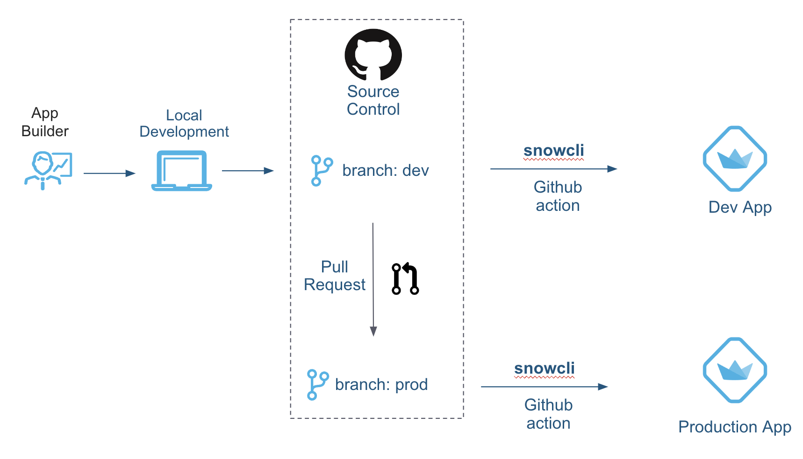

# CICD for Streamlit in Snowflake apps using Snowflake CLI

This demo shows how to create a full CI/CD workflow for deploying Streamlit apps to Snowflake using GitHub Actions and [Snowflake CLI](https://docs.snowflake.com/en/developer-guide/snowflake-cli-v2/index).

## Prerequires

* [Install Snowflake CLI](https://docs.snowflake.com/en/developer-guide/snowflake-cli-v2/installation/installation)
* You have a repository on GitHub.com where you can add files.
* You have access to GitHub Actions.

## Setup




## Description

This demo assumes that you are using 2 branches: `dev` and `main`. Corresponding to each of these branches a Github Action workflow is set up. 

* [.github/workflows/dev.yml](./.github/workflows/dev.yml): Describes the Github action that takes the code from the `dev` branch, and in the `dev` folder and deploys it to Snowflake

* [.github/workflows/main.yml](./.github/workflows/main.yml): Describes the Github action that takes the code from the `main` branch, and in the `prod` folder and deploys it to Snowflake


## Development Workflow #1

1. Edit code locally in the `dev` branch, and push the dev branch to Github. This triggers a Github action that deploys the app to Snowflake using Snowflake CLI
2. Validate the app functionality in `dev` branch by looking at the app
3. If all changes look good, copy the python code from the `dev` folder into the `prod` folder. 
4. Push the code to Github
5. To promote the code to Production, submit a Pull Request from `dev` branch to `main` branch

## Development Workflow #2

1. Run your app locally with ```streamlit run streamlit_app.py```
2. Create a dev app with ```snow streamlit deploy --replace```
3. Push to the main branch in your repo where the GitHub action will deploy your application to prod. 


Note: The GitHub action sits in the `.github/workflows` folder, and relies on a GitHub secret called ```SNOWCLI_PW``` which contains the password to your Snowflake account.

