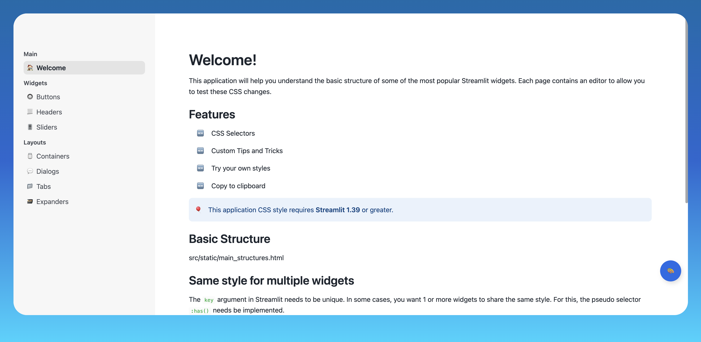

# CSS Based Widget Customization in Streamlit
This application will help you understand the basic structure of some of the most popular Streamlit widgets. Each page shows the CSS code and how it changes a Streamlit widget's UX.

Note: This app requires Streamlit v1.39 or higher.

## Credits

This app was developed by **Carlos D. Serrano**, who is a Sr. Architect for Solutions Innovation at Snowflake
* [LinkedIn](https://www.linkedin.com/in/carlosdserrano)
* [Medium](https://medium.com/@serranocarlosd)
