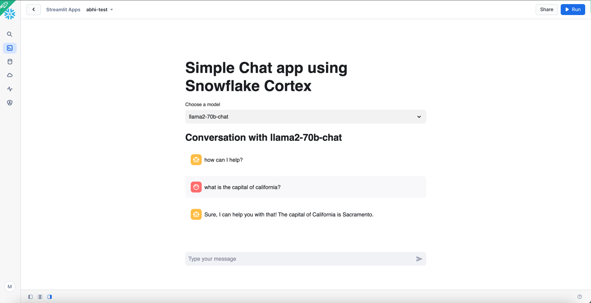

# Simple Chat app
Use Snowflake Cortex to build a LLM chat app

[Snowflake Cortex](https://docs.snowflake.com/en/user-guide/snowflake-cortex/llm-functions) gives users instant access to industry-leading large language models (LLMs) trained by researchers at companies like Mistral, Meta, and Google. It also offers models that Snowflake has fine-tuned for specific use cases.

## About this app
This app shows how to build a very simple chat app using hosted Snowflake Cortex models. 