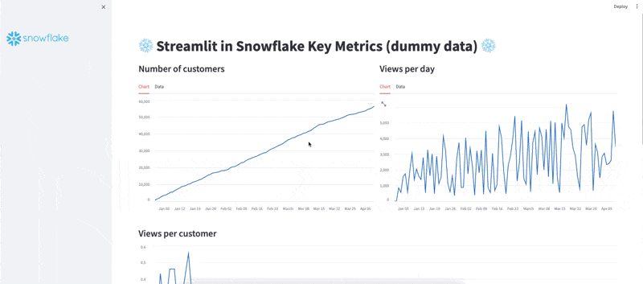

# Snowflake Summit Demo 2024

This repo contains a demo that was used during the Snowflake Summit in June of 2024. In this demo we show
users how to create a full CI/CD workflow with GitHub and the SnowCLI, along with how to use Snowflake Cortex
inside Streamlit in Snowflake.

## Setup

To set up this repo, clone it and set up your [SnowCLI config](https://docs.snowflake.com/en/developer-guide/snowflake-cli-v2/index). The general flow is to run your app locally with ```streamlit run streamlit_app.py```, then create a dev app with ```snow streamlit deploy --replace```, and finally push to your own GitHub repo where the GitHub action will deploy your application to prod. The GitHub action sits in the .github/workflows folder, and relies on a GitHub secret called ```SNOWCLI_PW``` which contains the password to your Snowflake account.

This demo's local config file (```~/.snowflake/config.toml```) points to my development schema (called ```DEV_SIS_APPS```), which contains in development apps, while the GitHub action has the exact same info but points to my production schema (```SIS_APPS```). You can create these same databases and schemas if you want to run an exact copy, or replace with your own.

The end of the app relies on a table created in the demo called ```streamlit.public.feedback_table```. To create this table, you can [upload](https://docs.snowflake.com/en/user-guide/data-load-web-ui) the dummy data supplied in the ```feedback.csv``` file.

Note: All data in this demo is dummy data, and this demo used a trial account. Please add your own info to the ```tmp_config.toml``` file to use.

Questions? Please email tyler.richards@snowflake.com to get more info.

## Demo App Preview
