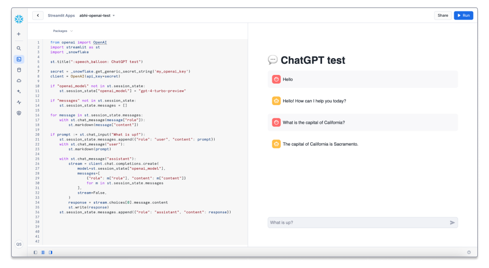

# Simple Chat app using a 3rd Party LLM
Accessing 3rd Party LLMs using External Access attached to a Streamlit object



> **_NOTE:_**  External Access for Streamlit in Snowflake is in *Private Preview*. To enable this on your account please contact 
your Account Executive, Sales Engineer or the Snowflake support team. To learn more about 
External Access for Streamlit objects, check out the [LIMITEDACCESS documentation](https://docs.snowflake.com/en/LIMITEDACCESS/streamlit/external-network-access)

## Prerequisites

1. An OpenAI account and OpenAI key
2. A role with privileges needed to create NETWORK RULES, 


## Creating the External Access Integration

#### Step 1. Creating a Network Rule

For security, Snowflake requires that when creating a network rule, you must use a role that has the `CREATE NETWORK RULE` privilege on the schema that will hold the rule.


```sql
CREATE OR REPLACE NETWORK RULE network_rules
    MODE = EGRESS
    TYPE = HOST_PORT
    VALUE_LIST = ('api.openai.com');
```

#### Step 2. Creating a Secret 

This step is required if the endpoint requires an access token or  authentication. 

If the API is a public endpoint without any auth then no secrets are needed and this step can be skipped. Any future steps or references to secrets can also be ignored. 

For security, Snowflake requires that when creating a secret, you must use a role that has the `CREATE SECRET` privilege on the schema that will hold the secret.

```sql
CREATE OR REPLACE SECRET openai_key
    TYPE = GENERIC_STRING
    SECRET_STRING = '<openai-key>';
```

#### Step 3. Creating the External Access Integration

To see the privileges needed, see [Access Control Requirements](https://docs.snowflake.com/en/sql-reference/sql/create-external-access-integration#access-control-requirements) for creating an External Access Integration

```sql
CREATE OR REPLACE EXTERNAL ACCESS INTEGRATION openai_access_int
    ALLOWED_NETWORK_RULES = (network_rules)
    ALLOWED_AUTHENTICATION_SECRETS = (openai_key)
    ENABLED = true;
```

## Using SECRETS and INTEGRATION objects in your apps

#### Step 4. Granting access on SECRET and INTEGRATION objects

```sql
GRANT READ ON SECRET openai_key TO ROLE DATA_SCIENTIST;
GRANT USAGE ON INTEGRATION openai_access_int TO ROLE DATA_SCIENTIST;
```

#### Step 5. Attaching an External Access Integration to a Streamlit app

```sql
ALTER STREAMLIT DB.SCHEMA.<APP_NAME>
SET EXTERNAL_ACCESS_INTEGRATIONS=(openai_access_int)
SECRETS = ('my_openai_key' = DB.SCHEMA.openai_key);
```


