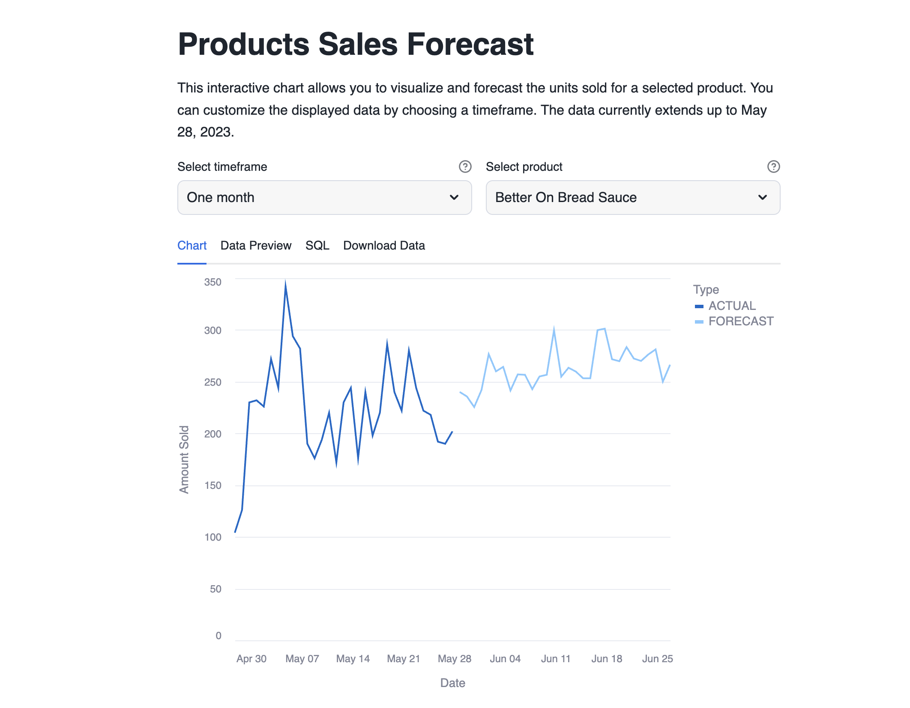
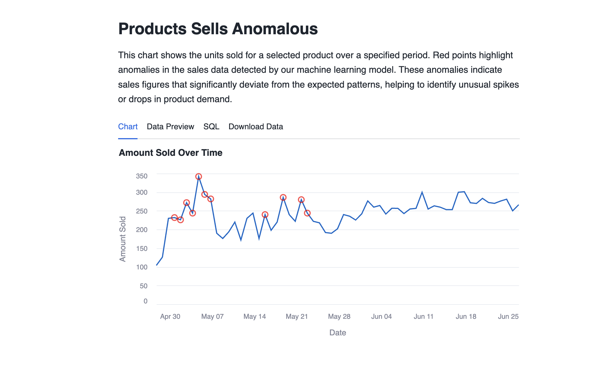

# Forecasting and Anomaly Detection
This app demonstrates how to do time series forecasting and anomaly detection on product sales data. It uses Snowflake ML Functions for training
these models. 

Learn more about [Time-Series Forecasting](https://docs.snowflake.com/en/user-guide/ml-functions/forecasting) as well as 
the [SNOWFLAKE.ML.FORECAST](https://docs.snowflake.com/en/sql-reference/classes/forecast) commands. 

Learn more about [Anomaly Detection](https://docs.snowflake.com/en/user-guide/ml-functions/anomaly-detection) as well as the 
[SNOWFLAKE.ML.ANOMALY_DETECTION](https://docs.snowflake.com/en/sql-reference/classes/anomaly_detection) commands.

Below, you will find detailed descriptions of two key charts that help you monitor and analyze your product sales data.

**Forecasting Chart 📈**\
This chart allows you to visualize and forecast the units sold for a selected product. You can customize the displayed data by choosing a timeframe (one, two, or three months). The data currently extends up to May 28, 2023. Use this tool to anticipate future sales trends and make informed business decisions.

**Anomaly Detection 🔍**\
This chart displays the units sold for a selected product over a specified period. Red points highlight anomalies in the sales data detected by our machine learning model. These anomalies represent sales figures that significantly deviate from expected patterns, helping you identify unusual spikes or drops in product demand. Use this insight to investigate potential issues or capitalize on unexpected opportunities.

## App data
1. Open a new SQL Worksheet.

2. Copy the contents of the file `data/creation_script.sql` into the Worksheet. Execute the all statements of the script, which creates a database, schema, stage, functions and the appropriate tables for the app.

3. When you create a new Streamlit App, Snowflake automatically generates a new stage for this app. Access this stage in the Data section on the left side of the screen. Navigate to Databases, find the database associated with your Streamlit App (e.g., `SampleDatabase.PRODUCT_FORECAST`).

4. Select the database, then choose the schema where you created the Streamlit App (e.g., public).

.

5. Navigate to Stages to view the available stages. Snowflake has automatically created a Stage with an autogenerated name.

.

6. Click on the stage name. The first time, it will prompt you to “Enable Directory Listing”. Click on that button.

.

7. Choose a warehouse.

.

8. Click on “+ Files” in the upper right corner to open a popup where you can add the required files.

9. Upload the files by clicking on the "Upload" button in the lower right corner. Note that if a file has the same name as an existing file in the stage, the new file will overwrite the previous one.

.

10. With these steps, you have successfully uploaded files into your Streamlit App.