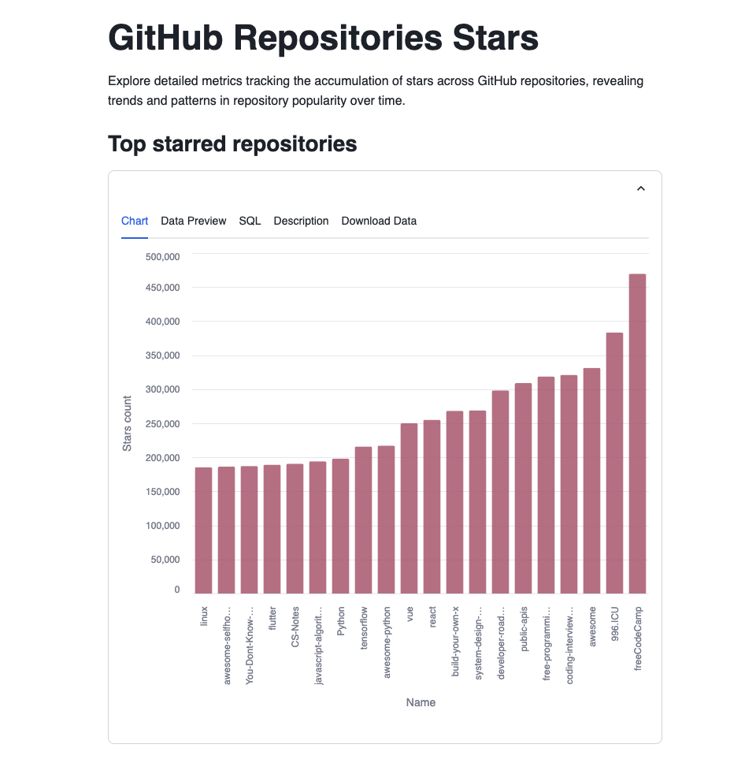
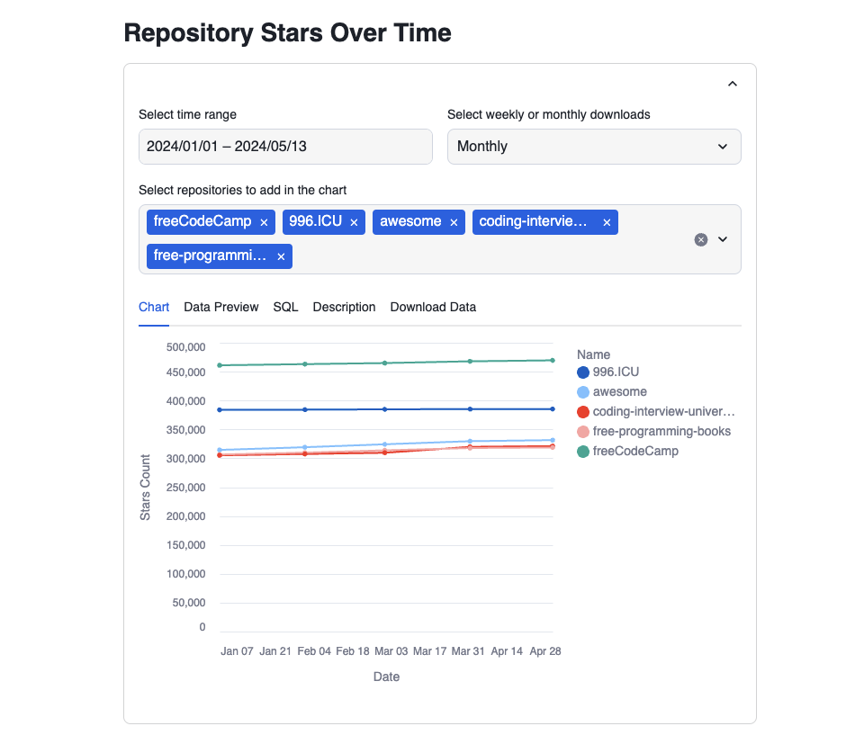
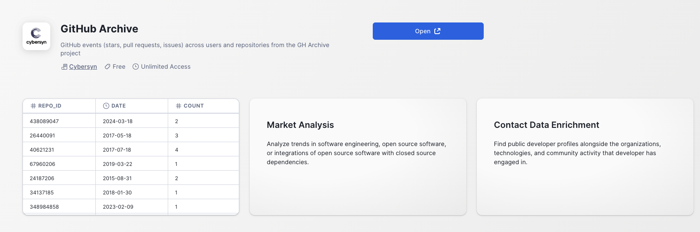

# GitHub Repositories Analytics & Insights
Explore GitHub's top repositories by stars with our analytics tool!
Discover the most popular projects ranked by star ratings and track their growth over time.\
Our charts showcase trending repositories, also their performance and evolution. 🌟📈🌐🚀

### Top 20 Repositories by Stars: 🌟\

Discover the most popular GitHub repositories ranked by the number of stars they've received.\
This chart highlights the top repositories based on star ratings, showcasing the trending projects on GitHub.

### Stars Over Time for Selected Repositories: 📈\

This chart display how stars have accumulated over time for your chosen repositories, allowing you to track their growth and popularity trends.

## App data

To get the data behind this app, follow these steps:

1. Open a new SQL Worksheet.

2. Copy the contents of the file `data/creation_script.sql` into the Worksheet. Execute the `CREATE` statements of the script, which creates a database and schema.

3. When you create a new Streamlit App, Snowflake automatically generates a new stage for this app. Access this stage in the Data section on the left side of the screen. Navigate to Databases, find the database associated with your Streamlit App (e.g., `SampleDatabase.Stargazers`).

4. Select the database, then choose the schema where you created the Streamlit App (e.g., public).

.

5. Navigate to Stages to view the available stages. Snowflake has automatically created a Stage with an autogenerated name.

.

6. Click on the stage name. The first time, it will prompt you to “Enable Directory Listing”. Click on that button.

.

7. Choose a warehouse.

.

8. Click on “+ Files” in the upper right corner to open a popup where you can add the required files.

9. Upload the files by clicking on the "Upload" button in the lower right corner. Note that if a file has the same name as an existing file in the stage, the new file will overwrite the previous one.

.

10. With these steps, you have successfully uploaded files into your Streamlit App.

11. Access this [shared database](https://app.snowflake.com/marketplace/listing/GZTSZAS2KJ3/cybersyn-github-archive) from [Cybersyn](https://www.cybersyn.com/) in order to get the GitHub repo information. 

.