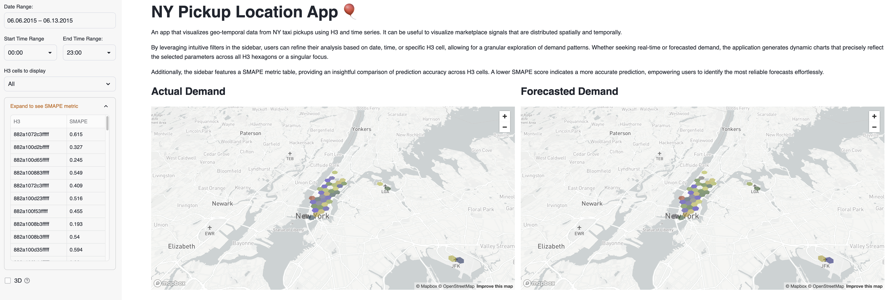
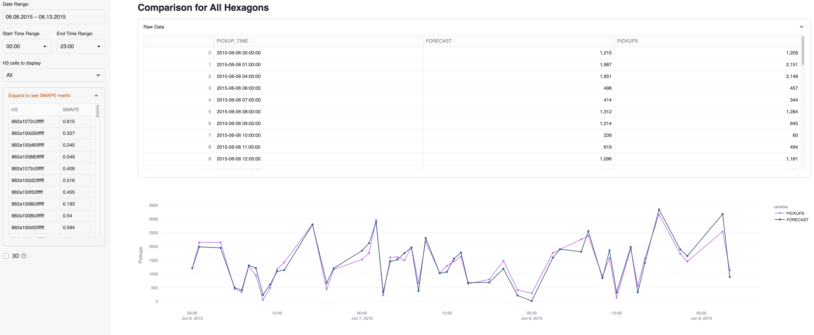

## NY Pickup Location App

An app that visualizes geo-temporal data from NY taxi pickups using H3 and time series.
It can be useful to visualize marketplace signals that are distributed spatially and temporally.

By leveraging intuitive filters in the sidebar, users can refine their analysis based on date,
time, or specific H3 cell, allowing for a granular exploration of demand patterns. Whether
seeking real-time or forecasted demand, the application generates dynamic charts that precisely
reflect the selected parameters across all H3 hexagons or a singular focus.

Additionally, the sidebar features a SMAPE metric table, providing an insightful comparison of
prediction accuracy across H3 cells. A lower SMAPE score indicates a more accurate prediction,
empowering users to identify the most reliable forecasts effortlessly.

Check "Getting started with Geospatial AI and ML using Snowflake Cortex" [quickstart](https://quickstarts.snowflake.com/guide/geo-for-machine-learning/index.html?index=..%2F..index#2) for more details about the demand prediciton use case.

## App layout

Below we can see two charts that show the comparision for the forecast and the actual pickup values by H3.



Here we can see a chart for the forecast and actual pickups as a time series.



## App data

To run this app the following objects need to be created in the Snowflake account:

```sql
CREATE OR REPLACE DATABASE h3_timeseries_visualization_db;
CREATE OR REPLACE SCHEMA h3_timeseries_visualization_db.h3_timeseries_visualization_s;

CREATE OR REPLACE STAGE h3_timeseries_visualization_db.h3_timeseries_visualization_s.geostage
  URL = 's3://sfquickstarts/hol_geo_spatial_ml_using_snowflake_cortex/';

CREATE OR REPLACE FILE FORMAT geocsv TYPE = CSV SKIP_HEADER = 1 FIELD_OPTIONALLY_ENCLOSED_BY = '"';

CREATE OR REPLACE TABLE geolab.geometry.nl_cables_stations AS 
SELECT to_geometry($1) AS geometry, 
       $2 AS id, 
       $3 AS type 
FROM @geostage/nl_stations_cables.csv (file_format => 'geocsv');

CREATE OR REPLACE TABLE h3_timeseries_visualization_db.h3_timeseries_visualization_s.NY_TAXI_RIDES_COMPARE (
	H3 VARCHAR(16777216),
	PICKUP_TIME TIMESTAMP_NTZ(9),
	PICKUPS NUMBER(18,0),
	FORECAST FLOAT
) AS 
SELECT
$1, $2, $3, $4
FROM @h3_timeseries_visualization_db.h3_timeseries_visualization_s.geostage/ny_taxi_rides_compare.csv;

CREATE OR REPLACE TABLE h3_timeseries_visualization_db.h3_timeseries_visualization_s.NY_TAXI_RIDES_METRICS (
	H3 VARCHAR(16777216),
	SMAPE VARIANT
) AS
SELECT $1, $2
FROM @h3_timeseries_visualization_db.h3_timeseries_visualization_s.geostage/ny_taxi_rides_metrics.csv;
```