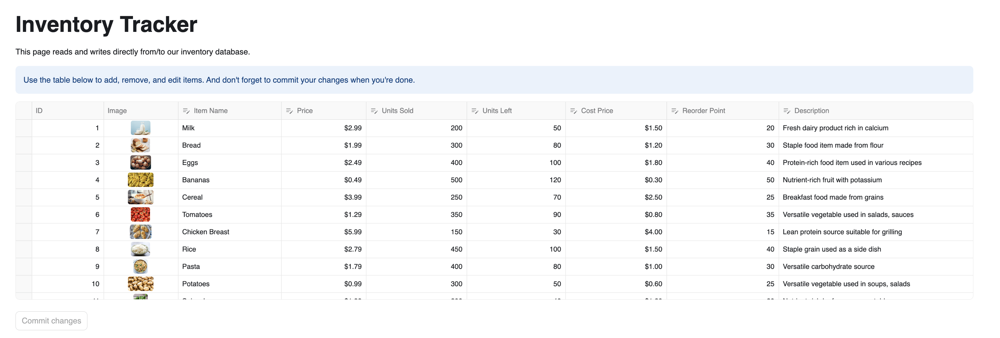
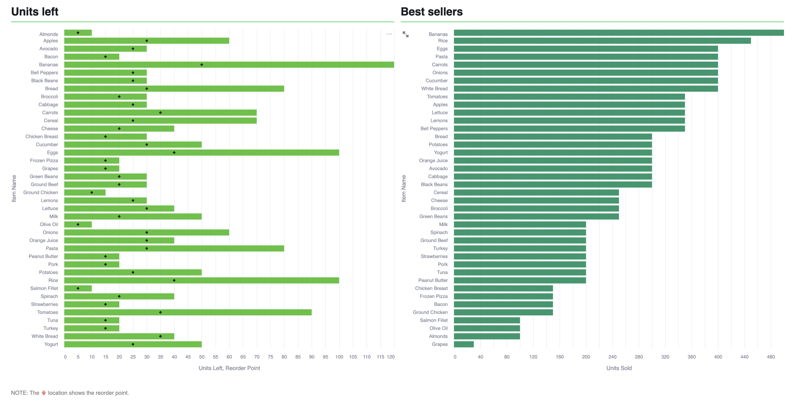

# Inventory Tracker
This inventory tracking application is designed to show off the ability for Streamlit in Snowflake apps to read from and write to your Snowflake account through the example of inventory management. Additionally, the application offers useful charts to easily identify if a product is running low on inventory, along with a best-seller chart for insights into product performance.

## App layout
Table that allows users to visualize and edit data directly on your Snowflake account.

Two charts, the first being a bar chart showing the units left in the inventory, the second being the best seller products.

## App data
Here is a short list with the required steps to replicated the required data.
1. Create a SQL Worksheet.
2. Copy the content of the file `data/creation_script.sql` into your worksheet and then run it. This script will create a database, stage and the appropriate tables for the app. It also execute some `INSERT` statements, so the table have some sample data.
3. Once you execute the script you should have a table called `inventory` (Under `SampleDatabase.InventoryTracker`), the structure of the table should be the following:

| item_name | price | units_sold | units_left | cost_price | reorder_point | description | image |
|-----------|:-----:|:----------:|:----------:|:----------:|:-------------:|:-----------:|:-----:|
| 'Milk'    | 2.99  |         200|          50|        1.50|             20| 'Fresh dairy product rich in calcium'| 'link/to/milk.jpg'
| 'Bread'   | 1.99  |        300 |         80 |       1.20 |             30 | 'Staple food item made from flour'  | 'link/to/bread.jpg'