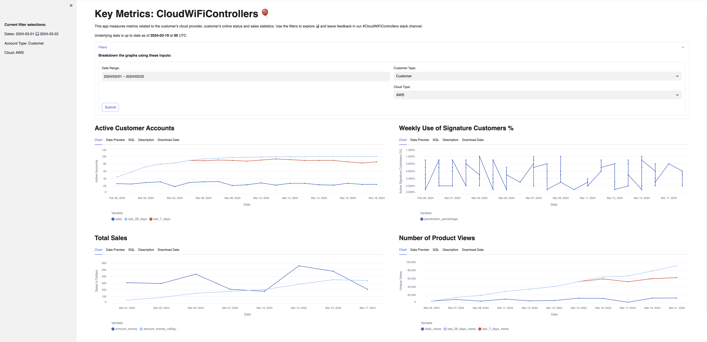

# Key Metrics: CloudWiFiControllers

This is the keymetrics for CloudWiFiControllers which is an app for a company with more than 40 years in the market that specializes in networking. The main product is WiFi controller on the cloud and the main idea behind it is to display metrics related to the used cloud provider, customers online status and sales statistics.

## App layout

Bellow we can see four different charts which can be filtered by date, customer type or cloud type.


## App data

To run this app the following objects need to be created in the Snowflake account:

```
CREATE OR REPLACE DATABASE KEY_METRICS_NEW_PRODUCT_DB;
USE DATABASE KEY_METRICS_NEW_PRODUCT_DB;
CREATE OR REPLACE SCHEMA KEY_METRICS_NEW_PRODUCT_S;
USE SCHEMA KEY_METRICS_NEW_PRODUCT_S;

-- Create a sequence
CREATE OR REPLACE SEQUENCE seq
  START WITH 1
  INCREMENT BY 1;

-- Create the METADATA_EXECUTES table
CREATE OR REPLACE TABLE KEY_METRICS_NEW_PRODUCT_DB.KEY_METRICS_NEW_PRODUCT_S.METADATA_EXECUTES (
	ACCOUNT_ID VARCHAR(16777216),
	CUSTOMER_ACCOUNT_TYPE VARCHAR(12),
	CLOUD VARCHAR(16777216)
);

-- Create the CALENDAR table
CREATE OR REPLACE TABLE KEY_METRICS_NEW_PRODUCT_DB.KEY_METRICS_NEW_PRODUCT_S.CALENDAR (
	_DATE TIMESTAMP_NTZ(9)
);

-- Create the EXECUTES table
CREATE OR REPLACE TABLE KEY_METRICS_NEW_PRODUCT_DB.KEY_METRICS_NEW_PRODUCT_S.EXECUTES(
    CREATED_ON TIMESTAMP_NTZ(9),
    ACCOUNT_ID VARCHAR(16777216),
    CLOUD VARCHAR(16777216),
    CUSTOMER_ACCOUNT_TYPE VARCHAR(12)
);

-- Create the PENETRATION table
CREATE OR REPLACE TABLE KEY_METRICS_NEW_PRODUCT_DB.KEY_METRICS_NEW_PRODUCT_S.PENETRATION (
	DATE DATE,
	PENETRATION_PERCENTAGE NUMBER(24,6),
	DAILY_MOVING_AVG_7_DAYS_PENETRATION_PERCENTAGE NUMBER(38,9)
);

-- Create the JOB_COST table
CREATE OR REPLACE TABLE KEY_METRICS_NEW_PRODUCT_DB.KEY_METRICS_NEW_PRODUCT_S.JOB_COST(
    CREATED_ON TIMESTAMP_NTZ(9),
    ORIGINAL_START_AT TIMESTAMP_LTZ(6),
    SALES FLOAT,
    JOB_ID NUMBER(38,0),
    CUSTOMER_ACCOUNT_TYPE VARCHAR(12),
    CLOUD VARCHAR(16777216)
);

-- Create the cloud_provider_view table
CREATE OR REPLACE TABLE KEY_METRICS_NEW_PRODUCT_DB.KEY_METRICS_NEW_PRODUCT_S.cloud_provider_view(
    NUM_VIEWS NUMBER(18,0),
    CUSTOMER_ACCOUNT_TYPE VARCHAR(12),
    DS DATE,
    CLOUD VARCHAR(16777216)
);
```

The following SQL code will populate the objects with random data:

```
-- Generate 100 random insert rows for the METADATA_EXECUTES table
INSERT INTO Key_Metrics_New_Product_DB.Key_Metrics_New_Product_S.METADATA_EXECUTES (
    ACCOUNT_ID,
    CUSTOMER_ACCOUNT_TYPE,
    CLOUD
)
SELECT
    'ACCOUNT_ID' || uniform(1, 100, random()) AS ACCOUNT_ID,
    CASE MOD(SEQ.nextval, 3)
        WHEN 0 THEN 'Internal'
        WHEN 1 THEN 'Partner'
        ELSE 'Customer'
    END,
    CASE MOD(uniform(1, 3, random()), 3)
        WHEN 0 THEN 'AZURE'
        WHEN 1 THEN 'GCP'
        ELSE 'AWS'
    END
FROM
    TABLE(GENERATOR(ROWCOUNT => 100));

-- Generate 100 random insert rows for the CALENDAR table
insert into Key_Metrics_New_Product_DB.Key_Metrics_New_Product_S.CALENDAR(_DATE)
(select DATEADD(DAY, -uniform(1, 20, random()), CURRENT_DATE()) AS _DATE
    FROM
    TABLE(GENERATOR(ROWCOUNT => 100)));

-- Generate 5000 random insert rows for the EXECUTES table
insert into Key_Metrics_New_Product_DB.Key_Metrics_New_Product_S.EXECUTES(
    CREATED_ON,
    ACCOUNT_ID,
    CLOUD,
    CUSTOMER_ACCOUNT_TYPE
)
(select
    DATEADD(DAY, -uniform(1, 20, random()), CURRENT_DATE()) AS CREATED_ON,
    'ACCOUNT_ID' || uniform(1, 100, random()) AS ACCOUNT_ID,
    CASE MOD(uniform(1, 3, random()), 3)
        WHEN 0 THEN 'AWS'
        WHEN 1 THEN 'GCP'
        ELSE 'AZURE'
    END AS CLOUD,
    CASE MOD(SEQ.nextval, 3)
        WHEN 0 THEN 'Internal'
        WHEN 1 THEN 'Partner'
        ELSE 'Customer'
    END
    FROM
    TABLE(GENERATOR(ROWCOUNT => 5000)));

-- Generate 100 random insert rows for the PENETRATION table
insert into Key_Metrics_New_Product_DB.Key_Metrics_New_Product_S.PENETRATION(
    DATE,
    PENETRATION_PERCENTAGE,
    DAILY_MOVING_AVG_7_DAYS_PENETRATION_PERCENTAGE
)
(select
    DATEADD(DAY, -uniform(1, 20, random()), CURRENT_DATE()) AS DATE,
    uniform(0.001, 0.01, random()) AS PENETRATION_PERCENTAGE,
    uniform(0.001, 0.01, random()) AS DAILY_MOVING_AVG_7_DAYS_PENETRATION_PERCENTAGE,
    FROM
    TABLE(GENERATOR(ROWCOUNT => 100)));

-- Generate 100 random insert rows for the JOB_COST table
insert into Key_Metrics_New_Product_DB.Key_Metrics_New_Product_S.JOB_COST(
    CREATED_ON,
    ORIGINAL_START_AT,
    SALES,
    JOB_ID,
    CUSTOMER_ACCOUNT_TYPE,
    CLOUD
)
(select
    DATEADD(DAY, -uniform(1, 20, random()), CURRENT_DATE()) AS CREATED_ON,
    DATEADD(DAY, -uniform(1, 20, random()), CURRENT_DATE()) AS ORIGINAL_START_AT,
    uniform(1, 500, random()) AS SALES,
    uniform(1, 100, random()) AS JOB_ID,
    CASE MOD(uniform(1, 3, random()), 3)
        WHEN 0 THEN 'Customer'
        WHEN 1 THEN 'Internal'
        ELSE 'Partner'
    END AS CUSTOMER_ACCOUNT_TYPE,
    CASE MOD(uniform(1, 3, random()), 3)
        WHEN 0 THEN 'AWS'
        WHEN 1 THEN 'GCP'
        ELSE 'AZURE'
    END AS CLOUD,
    FROM
    TABLE(GENERATOR(ROWCOUNT => 100)));

-- Generate 100 random insert rows for the cloud_provider_view table
insert into Key_Metrics_New_Product_DB.Key_Metrics_New_Product_S.cloud_provider_view(
    NUM_VIEWS,
    CUSTOMER_ACCOUNT_TYPE,
    DS,
    CLOUD
)
(select
    uniform(1800, 10000, random()) AS NUM_VIEWS,
    CASE MOD(uniform(1, 3, random()), 3)
        WHEN 0 THEN 'Customer'
        WHEN 1 THEN 'Internal'
        ELSE 'Partner'
    END AS CUSTOMER_ACCOUNT_TYPE,
    DATEADD(DAY, -uniform(1, 20, random()), CURRENT_DATE()) AS DS,
    CASE MOD(uniform(1, 3, random()), 3)
        WHEN 0 THEN 'AWS'
        WHEN 1 THEN 'GCP'
        ELSE 'AZURE'
    END AS CLOUD,
    FROM
    TABLE(GENERATOR(ROWCOUNT => 100)));
```
