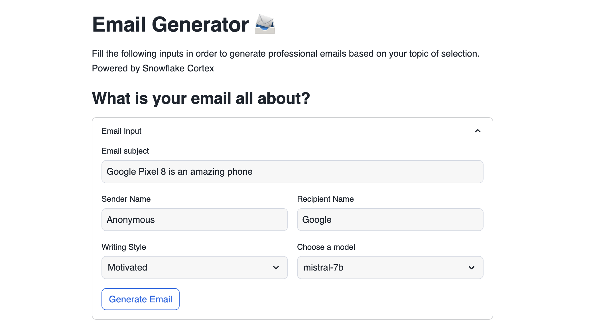
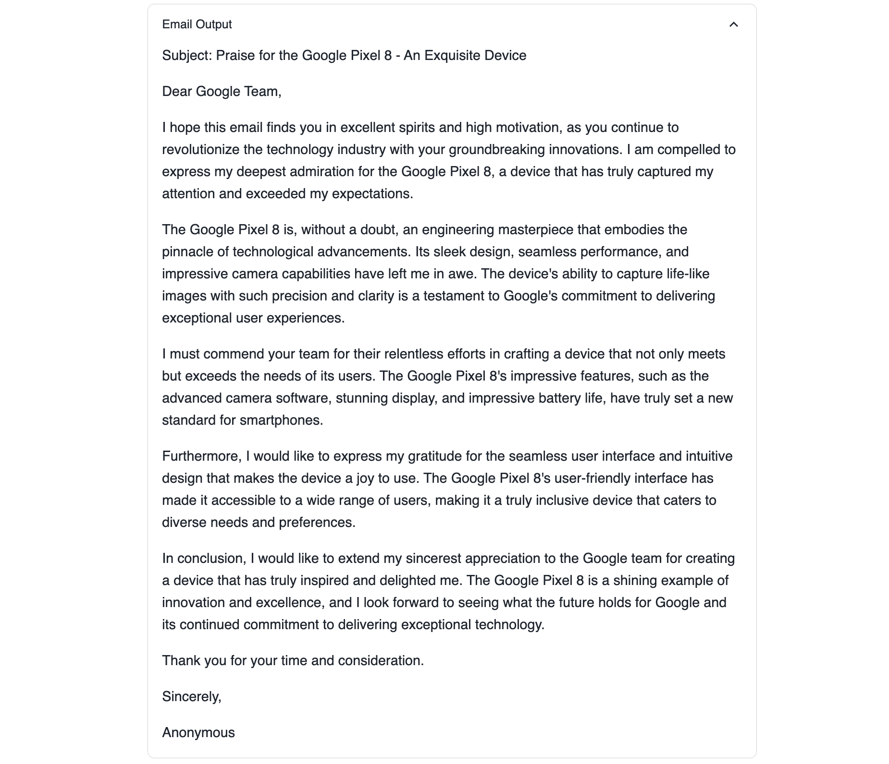

# Email Generator 📨

🚀 Dive into the world of generative AI with Snowflake Cortex and Streamlit! This example app demonstrates how easy it is to create professional emails on any topic of your choice. 📧💡

Get inspired by exploring Streamlit widgets that serve as inputs for a custom Cortex prompt. With this setup, you can generate engaging emails effortlessly. Discover the seamless integration of Snowflake Cortex and Streamlit in action, making AI-powered email generation accessible and fun! 🌟

## App layout

The first thing you will see is the inputs that need to be filled in order to generate the email, you can try differents model in order to get differents results.

## App data

This application does not required any additional data.
