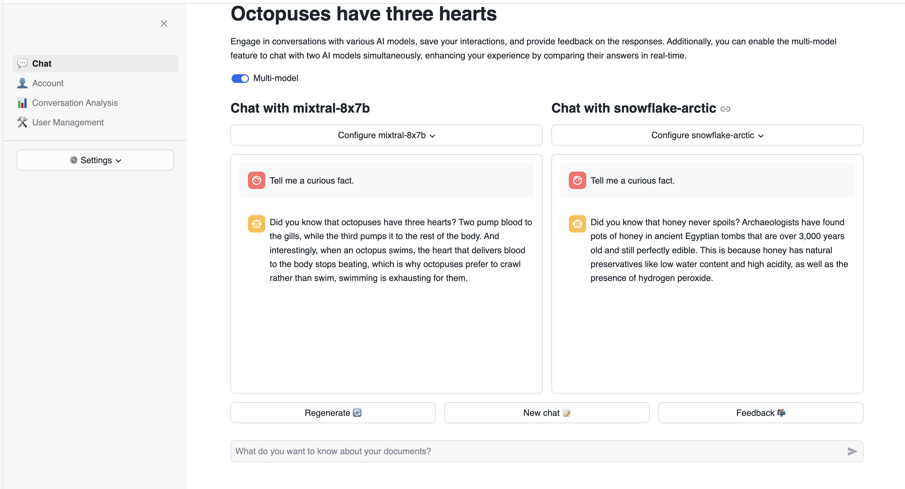
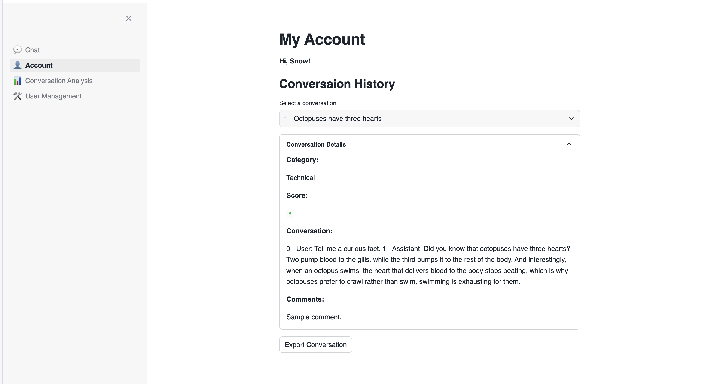
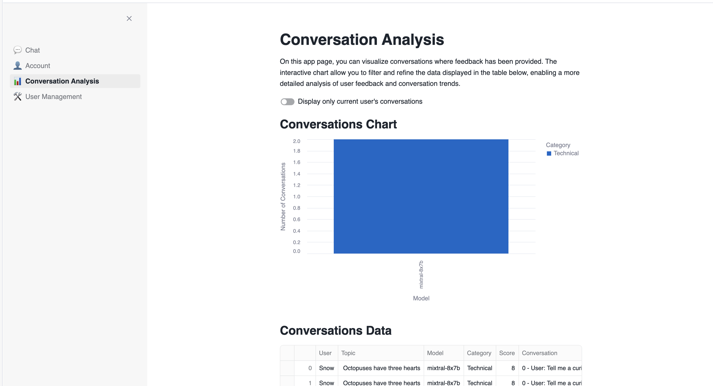
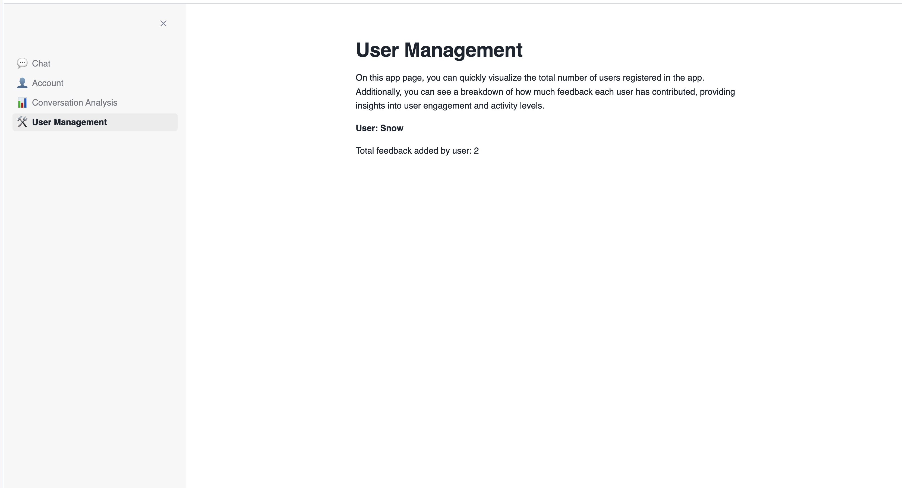
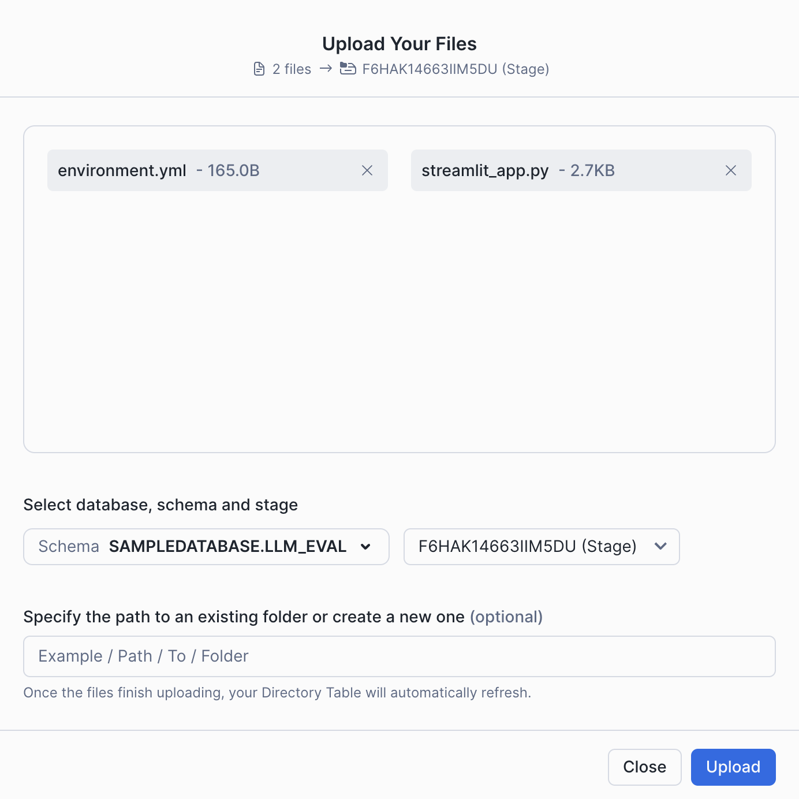
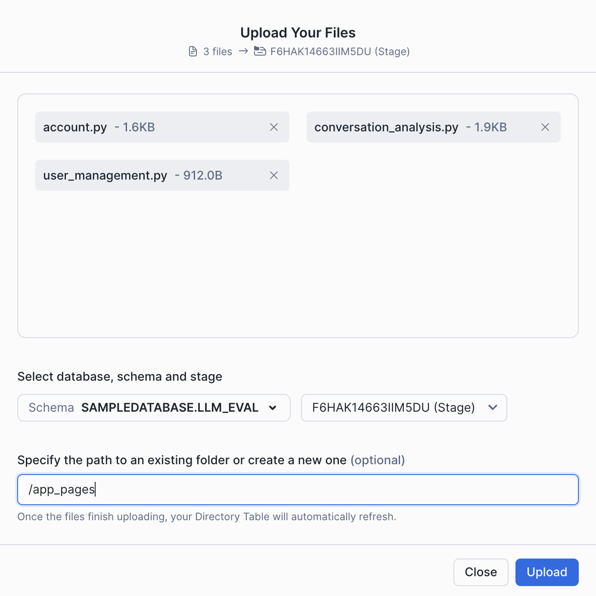
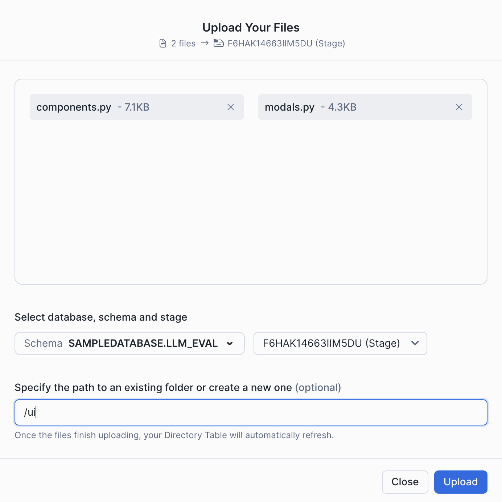
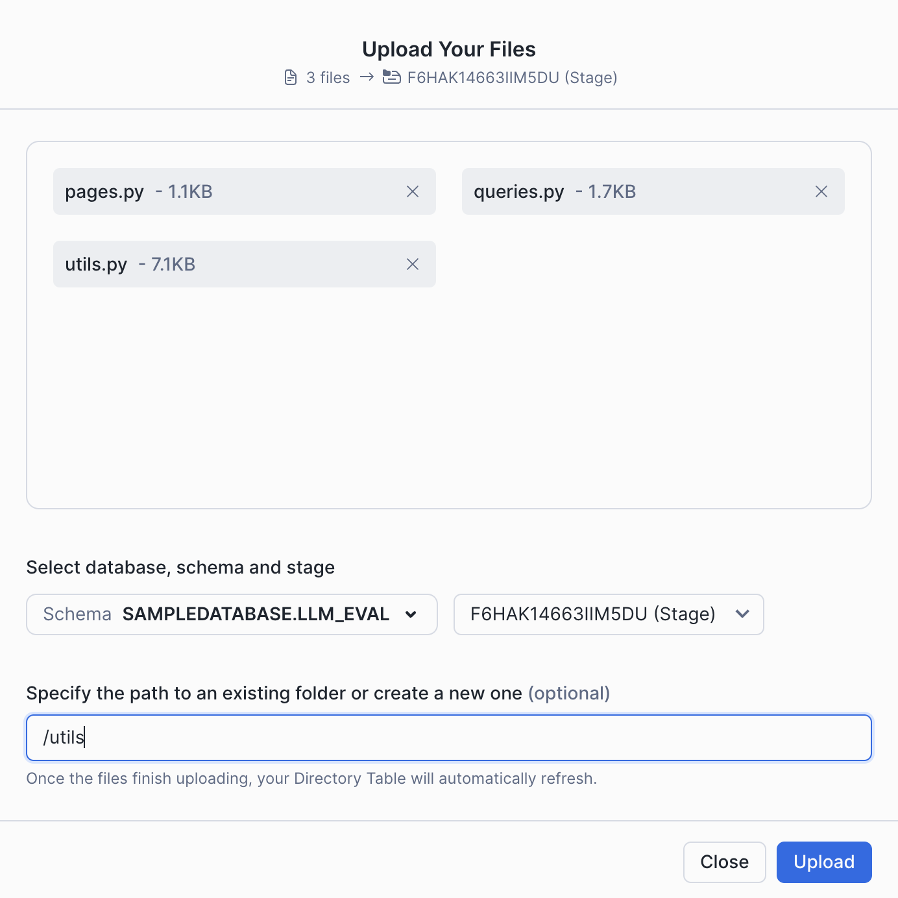

# LLM Evaluation App
Welcome to our LLM Evaluation App designed to support capturing human feedback in your generative AI applications.
This app is designed to be extendable to multiple generative AI use cases. It currently is setup to work with Snowflake Cortex LLMs, OpenAI models, and Cortex Search. The app provides a conversational interface to integrate with these models, but most importantly, includes the ability to provide feedback on the responses generated by the models. This feedback is then used to improve the models over time. The feedback is stored as a table inside Snowflake. 

## Key Features
- Supports a variety of generative AI applications
- Evaluation feedback supports feedback from multiple users
- Users can add a comment to explain their feedback
- An option to flag feedback for quicker identification
- This application works in Streamlit in Snowflake as well as locally

---

## Chat Page
Engage in conversations with various AI models, save your interactions, and provide feedback on the responses.
Additionally, you can enable the multi-model feature to chat with two AI models simultaneously, enhancing your experience by comparing their answers in real-time.


## Account Page


## Conversation Analysis Page
On this app page, you can visualize conversations where feedback has been provided.
The interactive chart allow you to filter and refine the data displayed in the table below, enabling a more detailed analysis of user feedback and conversation trends.



## User Management Page
On this app page, you can quickly visualize the total number of users registered in the app.
Additionally, you can see a breakdown of how much feedback each user has contributed, providing insights into user engagement and activity levels.


---

# Technical Notes:
This AI Chat application allows you to leverage the power of your preferred AI model, offering a choice between Snowflake Cortex and OpenAI's ChatGPT.

## Using Snowflake Cortex:
To integrate with Snowflake Cortex, simply install the necessary dependency, `snowflake-ml-python`.
The integration is straightforward, as demonstrated in the following example:
```python
from snowflake.cortex import Complete
import streamlit as st

session = st.connection("snowflake").session()

model = "snowflake-arctic"
prompt = "Tell me a story."

response = Complete(model, prompt, session=session)
```
## Using OpenAI ChatGPT:
To utilize OpenAI's ChatGPT, you need to create an `EXTERNAL ACCESS INTEGRATION` to connect with the OpenAI API.
The entire process is detailed in the `creation_script.sql` file, providing guidance on how to set this up.
You can either enable this external access directly in your Streamlit application or create a User-Defined Function (UDF) to interact with the API.
In this implementation, the UDF approach is used.

The UDF contains the following Python code, utilizing the official OpenAI Python library to fetch responses:
```python
def get_completion(MODEL: str, PROMPT: str) -> str:
    client = OpenAI(api_key=_snowflake.get_generic_secret_string("openai_key"))
    completion = client.chat.completions.create(
        model=MODEL,
        messages=[
            {
                "role": "user",
                "content": PROMPT,
            },
        ],
    )
    return completion.choices[0].message.content
```

## Using Cortex Search:
Cortex Search enables low-latency, high-quality “fuzzy” search over your Snowflake data.
Cortex Search powers a broad array of search experiences for Snowflake users including Retrieval Augmented Generation (RAG) applications leveraging Large Language Models (LLMs).

To utilize Cortex Search, you first need to prepare your data and create a Cortex Search service at the SQL level. Below is an example of how to create such a service:
```sql
CREATE OR REPLACE CORTEX SEARCH SERVICE SUSTAINABLE_ENERGY_SERVICE
ON DESCRIPTION
ATTRIBUTES TYPE
WAREHOUSE = SAMPLE_WH
TARGET_LAG = '1 day'
AS (
    SELECT
        DESCRIPTION,
        TYPE,
        ID
    FROM SUSTAINABLE_ENERGY
);
```
Once the service is created, you can integrate it into your Streamlit application to perform searches efficiently.
The following Python function demonstrates how to query the Cortex Search service and retrieve relevant results within your Streamlit app:

```python
def cortex_search_service(
    prompt: str, model: str, limit: int, column_name: str, session: Session
):
    """
    Queries the cortex search service in the session state and returns a list of results
    """
    root = Root(session)
    db = session.get_current_database()
    schema = session.get_current_schema()
    cortex_search_service = (
        root.databases[db].schemas[schema].cortex_search_services[model]
    )
    context_documents = cortex_search_service.search(prompt, [], limit=limit)
    return context_documents.results[0][column_name]
```

In this function, the `cortex_search_service` method is used to send a query to the Cortex Search service and retrieve a list of results based on the provided prompt.
The service is accessed through the session's state, ensuring seamless integration with your existing Snowflake infrastructure.
By leveraging Cortex Search in this way, you can enhance your application's ability to deliver relevant and timely information to users.

## Extending to Other AI Providers:
You can also create your own `EXTERNAL ACCESS INTEGRATION` to connect with other AI providers,
giving you the flexibility to choose the AI service that best suits your needs.

This setup allows for a seamless and customizable integration experience with various AI models,
ensuring that you can adapt the application to your specific requirements.


# Setting up the app
1. Open a new SQL Worksheet.

2. Copy the contents of the file `data/creation_script.sql` into the Worksheet. Execute the all statements of the script, which creates a database, schema, stage and the appropriate tables for the app. 

3. If you prefer to use Snowsight to upload the files, skip this step (Step 3) and proceed to the next part of the guide (Step 4). Alternatively, you can use SnowCLI. Here are some useful links to get you started:
    Here are some useful links:
    - [Installing and setting up SnowCLI](https://docs.snowflake.com/en/developer-guide/snowflake-cli-v2/index)
    - [Creating a Streamlit app](https://docs.snowflake.com/en/developer-guide/snowflake-cli-v2/streamlit-apps/manage-apps/initialize-app#label-snowcli-streamlit-project-definition)
    - [snow streamlit deploy](https://docs.snowflake.com/en/developer-guide/snowflake-cli-v2/command-reference/streamlit-commands/deploy#examples)

    The app comes with a pre-configured `snowflake.yml` file. If you've already set up SnowCLI, execute the following command to upload the files to a SiS environment:
    ```bash
    snow streamlit deploy --connection=your_connection --schema=LLM_EVAL --open
    ```
    Note: The `.streamlit/secrets.toml` file is available if you want to run this app locally on your machine. Simply enter your credentials to make it work.

4. When you create a new Streamlit App, Snowflake automatically generates a new stage for this app. Access this stage in the Data section on the left side of the screen. Navigate to Databases, find the database associated with your Streamlit App (e.g., `SampleDatabase.LLM_EVAL`).


5. Select the database, then choose the schema where you created the Streamlit App (e.g., public).

.

6. Navigate to Stages to view the available stages. Snowflake has automatically created a Stage with an autogenerated name.

.

7. Click on the stage name. The first time, it will prompt you to “Enable Directory Listing”. Click on that button.

.

8. Choose a warehouse.

.

9. Click on “+ Files” in the upper right corner to open a popup where you can add the required files.

10. Upload the files by clicking on the "Upload" button in the lower right corner. Note that if a file has the same name as an existing file in the stage, the new file will overwrite the previous one.

11. This app was developed using folders to keep it organized and clean. To upload these files using Snowsight, you need to recreate the folder structure in the Stage. Below, there is a photo showing where each file should be located. Note that at the end of each photo, the path where the file should be located is provided.

.
.
.
.

12. With these steps, you have successfully uploaded files into your Streamlit App.