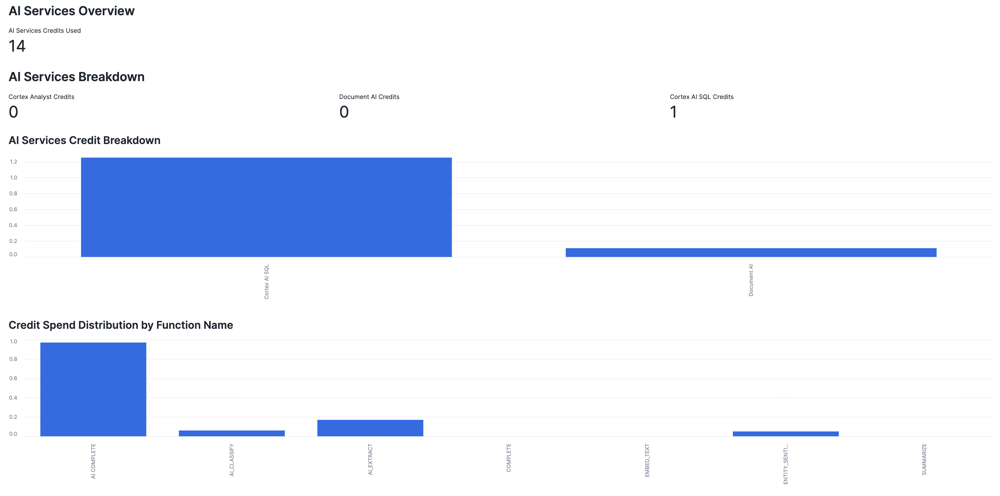
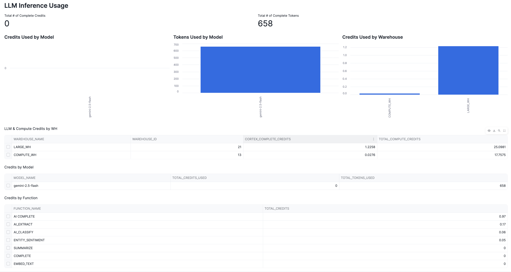
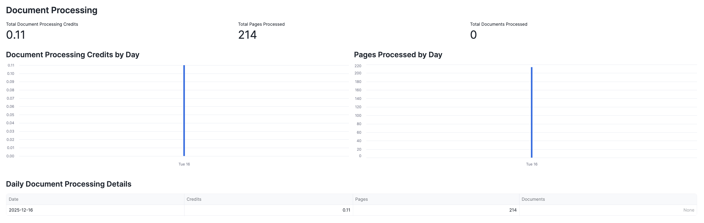
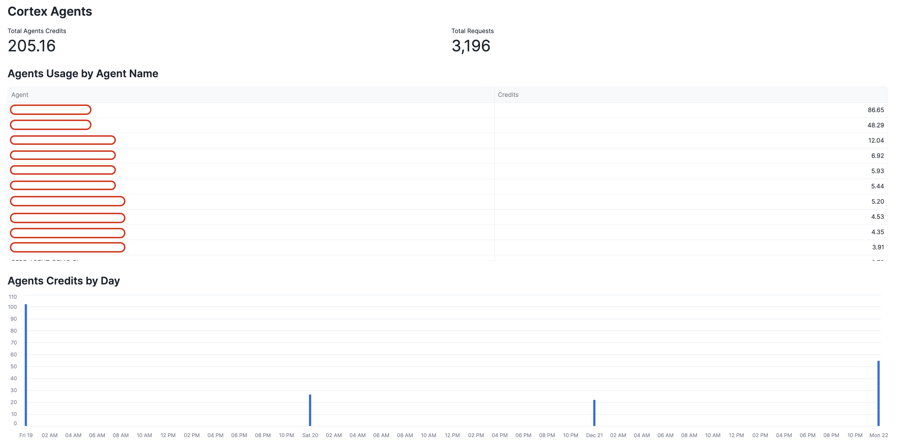

# LLM Usage App
Welcome to our LLM Usage Dashboard designed to monitor your Cortex Usage. 
It currently is setup to analyze your usage of Snowflake Cortex LLMs, Cortex Analyst, Cortex Search, Cortex Agents, and Document AI. The app provides comprehensive visibility into credit consumption, token usage, and request patterns across all Snowflake AI services. 

## Key Features
- Comprehensive Account Usage tracking including:
  - [CORTEX_AISQL_USAGE_HISTORY](https://docs.snowflake.com/en/sql-reference/account-usage/cortex_aisql_usage_history) - LLM inference tracking
  - [CORTEX_ANALYST_USAGE_HISTORY](https://docs.snowflake.com/en/sql-reference/account-usage/cortex_analyst_usage_history) - Analyst usage
  - [CORTEX_SEARCH_SERVING_USAGE_HISTORY](https://docs.snowflake.com/en/sql-reference/account-usage/cortex_search_serving_usage_history) - Search service usage
  - [CORTEX_AGENT_USAGE_HISTORY (PrPr)](https://docs.snowflake.com) - Agents usage tracking
  - [CORTEX_DOCUMENT_PROCESSING_USAGE_HISTORY](https://docs.snowflake.com/en/sql-reference/account-usage/cortex_document_processing_usage_history) - Document AI processing
  - [METERING_DAILY_HISTORY](https://docs.snowflake.com/en/sql-reference/account-usage/metering_daily_history) - Overall AI Services credits
- Credit and token tracking by model, function, warehouse, and service
- Daily usage trends and historical analysis
- Multi-service AI Services breakdown and comparison
- This application works in Streamlit in Snowflake as well as locally

## Set Up
Add the following Python Packages: pandas, plotly, snowflake-ml-python, snowflake-snowpark-python, streamlit.

### Prerequisites
- Access to Snowflake account with ACCOUNT_USAGE schema permissions
- Streamlit environment (either Streamlit in Snowflake or local installation)
- Active usage of Snowflake AI services to see data in the dashboard 

## Dashboard

### Date Filter

### AI Services Overview
The dashboard provides a comprehensive view of all AI services credit consumption with breakdown by service type.

### LLM Inference Usage

<!--  -->

### Cortex Analyst

### Document Processing

### Cortex Search

### Cortex Agents
