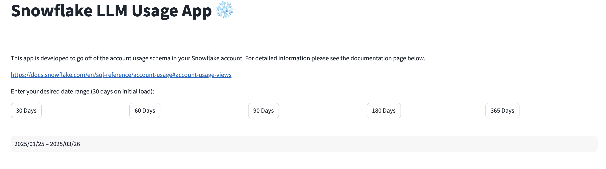
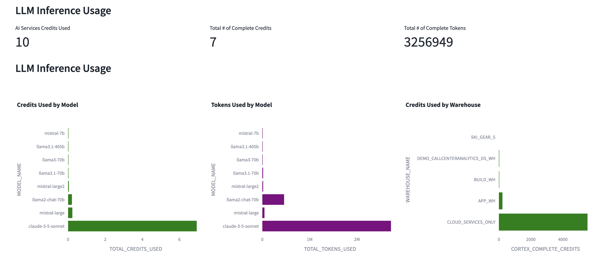
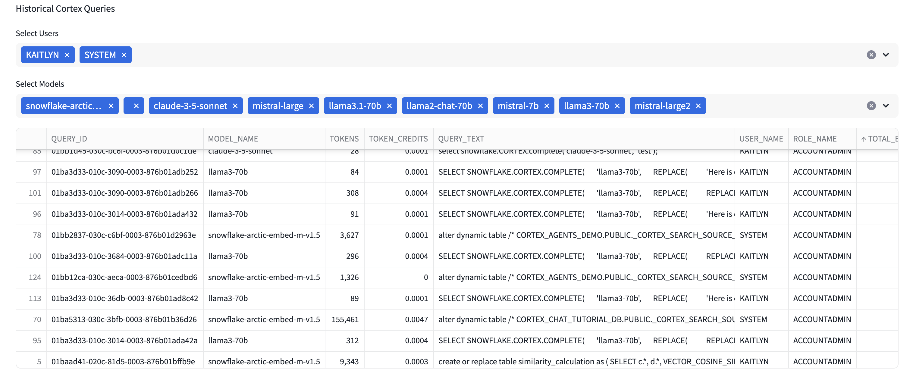
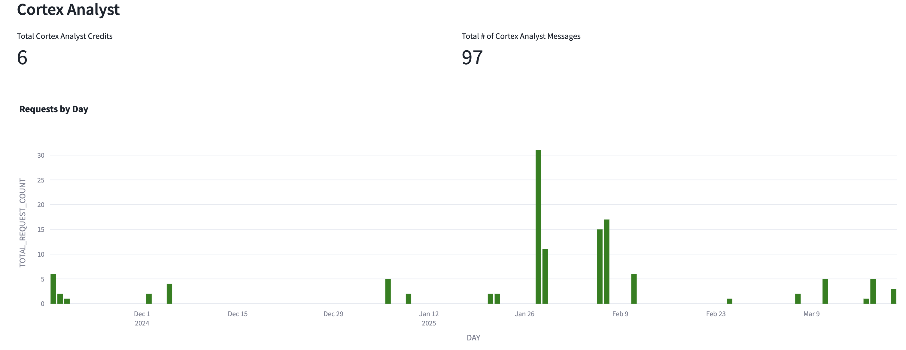
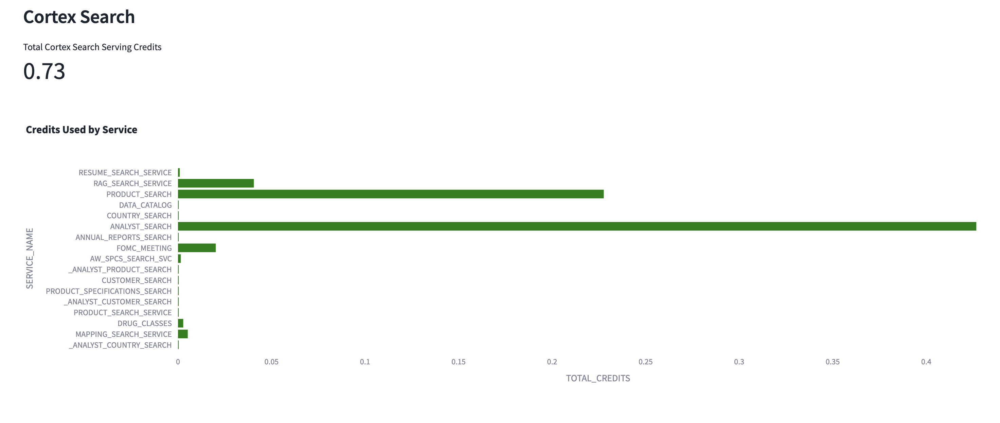

# LLM Usage App
Welcome to our LLM Usage Dashboard designed to monitor your Cortex Usage. 
It currently is setup to analyze your usage of Snowflake Cortex LLMs, Cortex Analyst and Cortex Search. The app provides a way to see total number of credits by LLM Model, number of tokens by model and the underlying historical queries. 

## Key Features
- Account Usage Views such [CORTEX_FUNCTIONS_USAGE_HISTORY](https://docs.snowflake.com/en/sql-reference/account-usage/cortex_functions_usage_history), [CORTEX_FUNCTIONS_QUERY_USAGE_HISTORY](https://docs.snowflake.com/en/sql-reference/account-usage/cortex_functions_query_usage_history), [CORTEX_ANALYST_USAGE_HISTORY](https://docs.snowflake.com/en/sql-reference/account-usage/cortex_analyst_usage_history), [QUERY_HISTORY](https://docs.snowflake.com/en/sql-reference/account-usage/query_history) and [CORTEX_SEARCH_SERVING_USAGE_HISTORY](https://docs.snowflake.com/en/sql-reference/account-usage/cortex_search_daily_usage_history)
- This application works in Streamlit in Snowflake as well as locally

##Set Up
Add the following Python Packages: pandas, plotly, snowflake-ml-python, snowflake-snowpark-python, streamlit. 

## Dashboard

