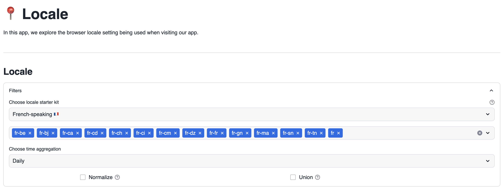
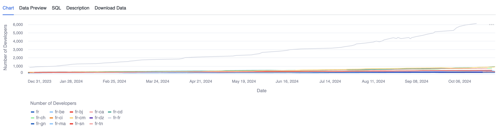
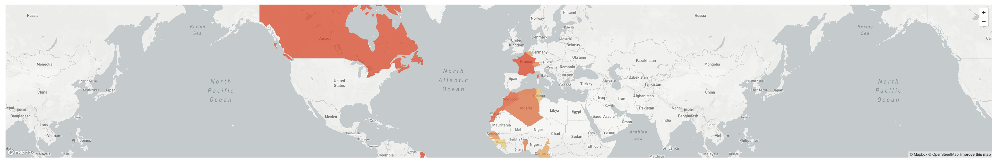
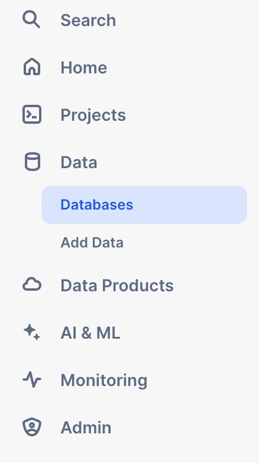

# Language Usage
This Streamlit app is designed to explore the language preferences of users visiting MyApp. This information is valuable for gaining insights into the global usage patterns of MyApp, enabling more in-depth analyses based on these language preferences.
In the "Languages" section, you can choose from a predefined set of languages or regions. You have the option to add or remove specific languages using the second selection box. Additionally, there are checkboxes available to normalize or combine the data based on your preferences.
Towards the bottom of the Streamlit app, you'll find a line chart that visualizes your language selections, providing a clear representation of usage trends. Below the chart, a heatmap displays user distribution by country, offering a geographical perspective on app usage across different regions.

## App layout
Settings related to the chart, here you can select the languages that you want to add in the chart. If you want to normalize or union the data, you can also select that option or even a time aggregation.

Then we have the bar chart with the selected settings.

Finally, we have a heatmap that shows the countries with the most users based on the language.

## App data
### Prerequisites:
- Have a Snowflake account.
- The Snowflake account should at least have the permissions to create new databases and tables.
- Here is the official [Streamlit documentation](https://docs.snowflake.com/en/developer-guide/streamlit/about-streamlit).
### Installation:
1. Create a new SQL Worksheet.
2. Copy the contents in the file `data/creation_script.sql` into your Worksheet, execute the `CREATE` statements of the script, which creates a database, schema, stage and the appropriate tables for the app.
3. On the rencently created `LANGUAGEUSAGE` you have to upload the `.csv` file located on the `data` folder (Filename: `locale_usage.csv`). You can use Snowsight to upload this files, under the database and schema created in the first step. Here is the [Snowflake](https://docs.snowflake.com/en/user-guide/data-load-web-ui) documentaion on how to this process.
4. Inside of the `creation_script.sql`, there are is a `COPY INTO` statement, so you can dump the data coming from the `.csv` into the recently created table, this statement can be run on the Worksheet, created in the first step.
5. When you create a new Streamlit App, as the example. Snowflake automatically creates a new stage for this app.
This stage can be accessed on in the Data section, in the left part of the screen. Then click on Databases, here a list of all the available databases will appear, look for the database where you created your Streamlit App (On this case SampleDatabase).

6. Click on the database, it will show all the available schemas, click on the schema where you created the Streamlit App (On this case public).

.

7. Click on stages, it will show all the available stages available, as mentioned earlier, Snowflake automatically generated a Stage, that have a autogenerated name.

.

8. Click on that name, the first time it will ask you to “Enable Directory Table”, click on that button.

.

9. Select a warehouse.

.

10. Click on “+ Files”, on the upper right corner, it will open a new popup where you can add the required files.

11. Click on Upload, on the lower right corner to upload the files. (Note: If a file have the same name as one already in the stage, the new file will overwrite the previous one)

.

12. And with that, you successfully upload files into your Streamlit App.

Once all the previous steps have been completed, under `SampleDatabase.LANGUAGEUSAGE`, you should have two tables `LOCALE_USAGE` and `COUNTRY_INFORMATION` with the following structure.
| Date       | Locale | Num_developers | Country  |
|------------|:------:|:--------------:|:--------:|
| 2024-01-06 | fr-fr  | 12             | France   |
| 2024-01-09 | en-us  | 13             | US       |
| 2024-01-14 | zh-ch  | 14             | China    |

| Country    | Geometry          |
|------------|:-----------------:|
| Tanzania   | {geometry_object} |
| Canada     | {geometry_object} |
| Argentina  | {geometry_object} |
