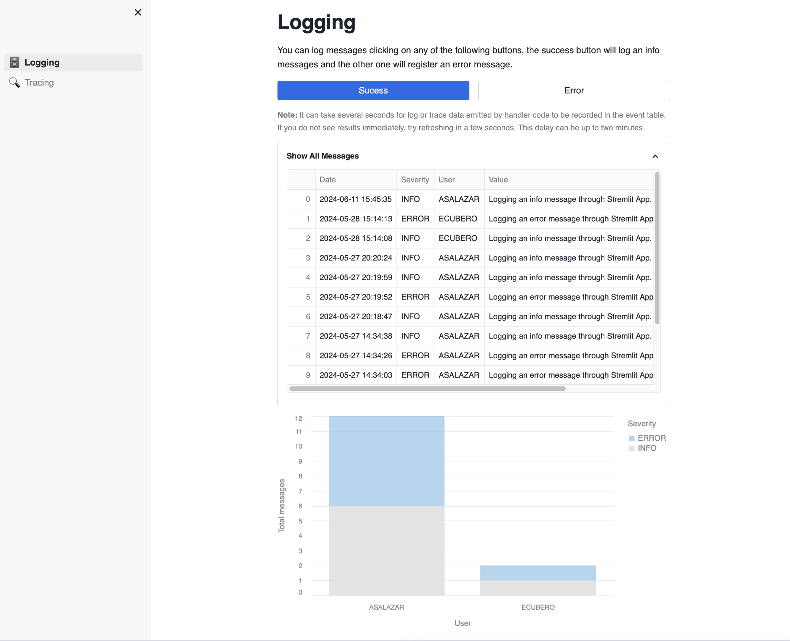
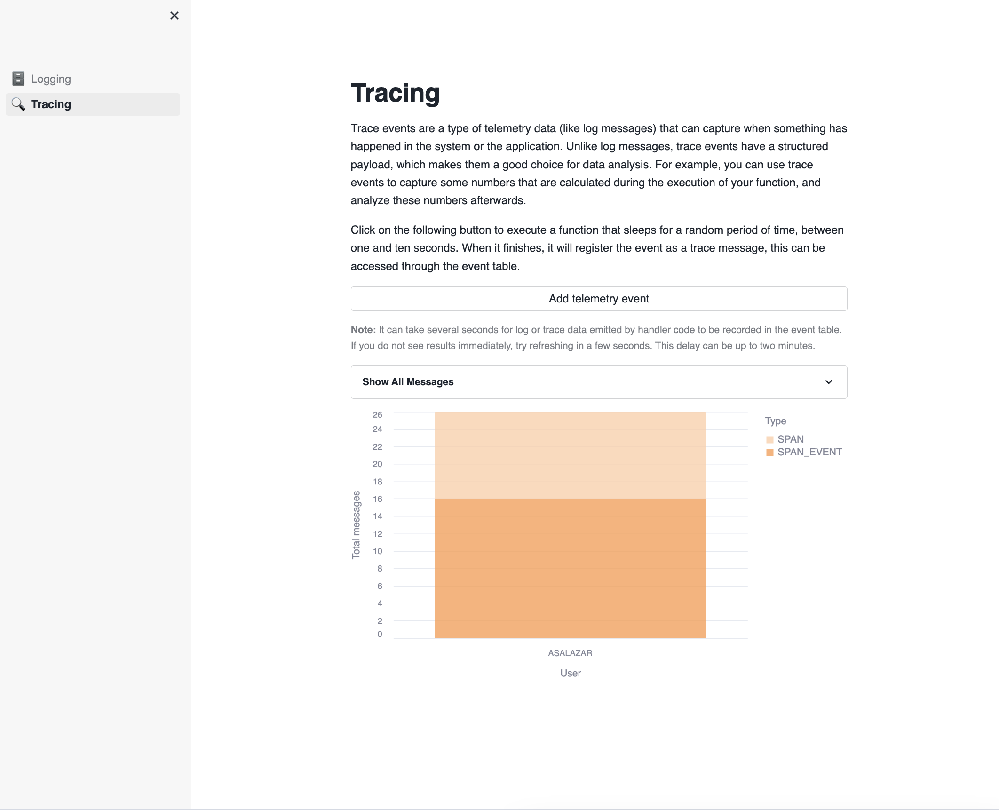

## Logging Demo 🗄️
This application is designed to help you learn how to effectively log messages and trace events using Snowflake’s telemetry API. This app provides an interactive and hands-on experience.

**Features:**
- Success Button ✅: Click to register an informational log entry.
- Error Button ❌: Click to register an error log entry.
- Log Table 📋: Displays all log entries generated by the Success and Error buttons.
- Chart 📊: Visualizes the number of times each button has been clicked, showing a comparison between success and error logs.



## Tracing Demo 🔍
This page showcases how to log the execution time of a function.

**Features:**
- Trace Button ⏱️: Executes a function that sleeps for a random duration between one and ten seconds, then registers a trace event with the duration.
- Trace Table 📋: Displays all trace events generated, including the duration of each function execution.
- Chart 📊: Visualizes the number of trace events and their durations, providing insights into the performance of the traced function.



## Requisites
**Create an event table** 

In Snowflake, store your log and trace data in an event table, a special kind of table with a predefined set of columns.
The following statement does not required any additional permissions, so you can create `EVENT TABLES` without any problems. Learn more in the documentation for [Setting up an Event Table](https://docs.snowflake.com/en/developer-guide/logging-tracing/event-table-setting-up)
```sql
CREATE EVENT TABLE SAMPLEDATABASE.LOGGING_AND_TRACING.SAMPLE_EVENTS;
```

The following statements require the `ACCOUNTADMIN` role to set the created event table as the account-wide event table and enable trace logging:
```sql
-- Associate the event table with the account
ALTER ACCOUNT SET EVENT_TABLE = SAMPLEDATABASE.LOGGING_AND_TRACING.SAMPLE_EVENTS;

-- Set log level
ALTER DATABASE STREAMLIT_TEST SET LOG_LEVEL = INFO;

-- Set trace level
ALTER DATABASE SAMPLEDATABASE SET TRACE_LEVEL = ON_EVENT;
```

If you want to undo this action, you can execute the following query.
```sql
ALTER ACCOUNT UNSET EVENT_TABLE;
```
**Begin emitting log or trace data from handler code** 📝.\
Once you've created an event table and associated it with your account, use an API in the language of your handler to emit log messages from handler code. After capturing log and trace data, you can query the data to analyze the results.

**Related Snowflake Documentation** 📚:
- [Setting up an Event Table](https://docs.snowflake.com/en/developer-guide/logging-tracing/event-table-setting-up)
- [Logging and Tracing Overview](https://docs.snowflake.com/en/developer-guide/logging-tracing/logging-tracing-overview)
- [Logging messages in Python](https://docs.snowflake.com/en/developer-guide/logging-tracing/logging)
- [Trace Events for Functions and Procedures](https://docs.snowflake.com/en/developer-guide/logging-tracing/tracing)
- [Setting log level](https://docs.snowflake.com/en/developer-guide/logging-tracing/logging-log-level)
- [Setting trace level](https://docs.snowflake.com/en/developer-guide/logging-tracing/tracing-trace-level)

## Installation
1. Open a new SQL Worksheet.

2. Copy the contents of the file `data/creation_script.sql` into the Worksheet. Execute the all statements of the script, which creates a database, schema, stage and the event table for the app.

3. When you create a new Streamlit App, Snowflake automatically generates a new stage for this app. Access this stage in the Data section on the left side of the screen. Navigate to Databases, find the database associated with your Streamlit App (e.g., `SAMPLEDATABASE.LOGGING_AND_TRACING`).


4. Select the database, then choose the schema where you created the Streamlit App (e.g., public).

.

5. Navigate to Stages to view the available stages. Snowflake has automatically created a Stage with an autogenerated name.

.

6. Click on the stage name. The first time, it will prompt you to “Enable Directory Listing”. Click on that button.

.

7. Choose a warehouse.

.

8. Click on “+ Files” in the upper right corner to open a popup where you can add the required files.

9. Upload the files by clicking on the "Upload" button in the lower right corner. Note that if a file has the same name as an existing file in the stage, the new file will overwrite the previous one (Select all the files in the root of the folder).

.

10. With these steps, you have successfully uploaded files into your Streamlit App.