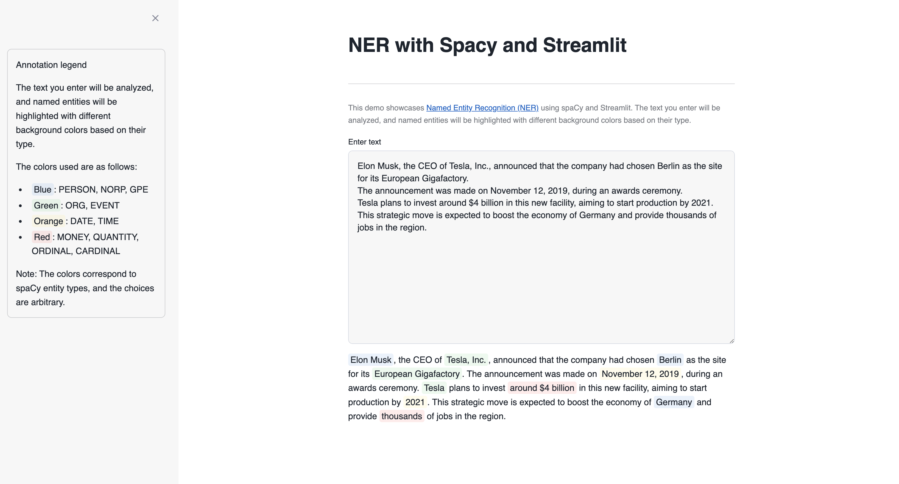
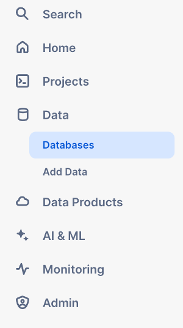
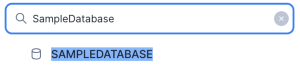
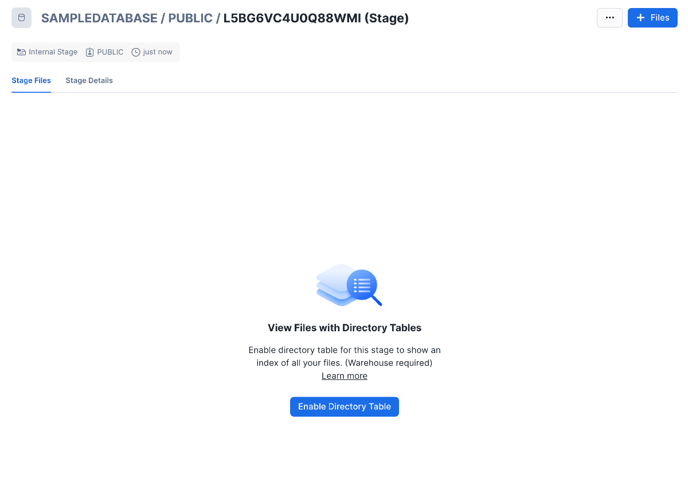

# Named Entity Recognition using Spacy
This app uses [Spacy's en_core_web_sm](https://spacy.io/models/en#en_core_web_sm) english pipeline model, which is available under a MIT License. This english model is also available in Snowflake's Anaconda channel. 

The app allows users to input text and perform Named Entity analysis with named entities highlighted in different background colors based on their type.
Simply enter any text into the provided field, and the app will process it using spaCy's advanced NER capabilities. Entities such as names, organizations, dates, and monetary values will be identified and color-coded for easy visualization:
- Blue: PERSON, NORP, GPE
- Green: ORG, EVENT
- Orange: DATE, TIME
- Red: MONEY, QUANTITY, ORDINAL, CARDINAL

This interactive tool is designed to help users understand and explore the power of NER in natural language processing, providing clear and immediate visual feedback on the types of entities recognized within the text.

## App data
1. Open a new SQL Worksheet.

2. Copy the contents of the file `data/creation_script.sql` into the Worksheet. Execute the `CREATE` statements of the script, which creates a database and schema for the app.

3. When you create a new Streamlit App, Snowflake automatically generates a new stage for this app. Access this stage in the Data section on the left side of the screen. Navigate to Databases, find the database associated with your Streamlit App (e.g., `SampleDatabase.SPACY`).

4. Select the database, then choose the schema where you created the Streamlit App (e.g., public).

.

5. Navigate to Stages to view the available stages. Snowflake has automatically created a Stage with an autogenerated name.

.

6. Click on the stage name. The first time, it will prompt you to “Enable Directory Listing”. Click on that button.

.

7. Choose a warehouse.

.

8. Click on “+ Files” in the upper right corner to open a popup where you can add the required files.

9. Upload the files by clicking on the "Upload" button in the lower right corner. Note that if a file has the same name as an existing file in the stage, the new file will overwrite the previous one.

.

10. With these steps, you have successfully uploaded files into your Streamlit App.