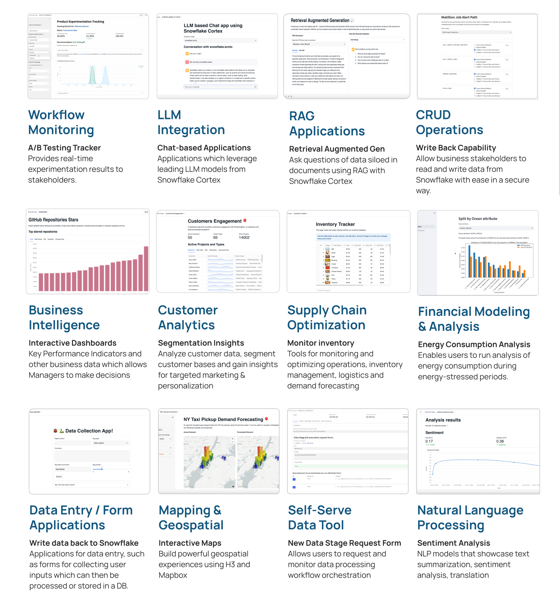

# Streamlit in Snowflake Demos

This repo contains a collection of Streamlit in Snowflake demos, tutorials, and examples. Browse each folder to access the files associated with each demo.


## Prerequisites

Install [Snowflake CLI](https://docs.snowflake.com/en/developer-guide/snowflake-cli/installation/installation) (>= 3.14):

```bash
brew install snowflake-cli
```

**Optional (Recommended):** Install [Cortex Code CLI](https://docs.snowflake.com/en/user-guide/cortex-code/cortex-code-cli) for AI-assisted development and debugging of Streamlit apps.

## Repository structure

Every folder is an independent Streamlit app containing code, setup scripts and sample data needed to run the app. Every app contains a README file which serves as a guide to setting up the app and using it. 


## Use Cases

Streamlit in Snowflake can be used for a variety of use cases. 



## License

All app code included in this repo is available with an Apache 2.0 license.

## Resources

Here are some resources to learn more:

* [Streamlit in Snowflake Website](https://www.snowflake.com/en/data-cloud/overview/streamlit-in-snowflake/)
* Streamlit in Snowflake [Documentation](https://docs.snowflake.com/en/developer-guide/streamlit/about-streamlit)
* Streamlit Open Source [Documentation](https://docs.streamlit.io/)
* Streamlit in Snowflake [Release Notes](https://docs.snowflake.com/en/release-notes/streamlit-in-snowflake)


## Other links

* Interested in running Python code in Snowflake Notebooks? Check out the [Snowflake Demo Notebooks Repo](https://github.com/Snowflake-Labs/snowflake-demo-notebooks/tree/main)
