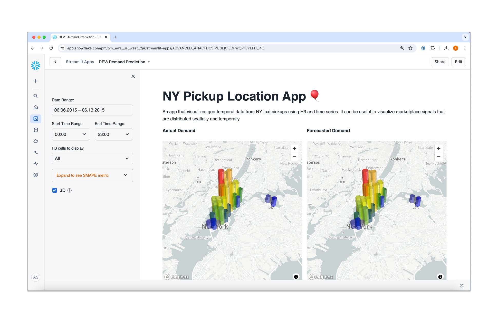

# Streamlit in Snowflake Demos

This repo contains a collection of Streamlit in Snowflake demos, tutorials, and examples. Browse each folder to access the files associated with each demo.

## Repository structure

Every folder is an independent Streamlit app containing code, setup scripts and sample data needed to run the app. Every app contains a README file which serves as a guide to setting up the app and using it. 