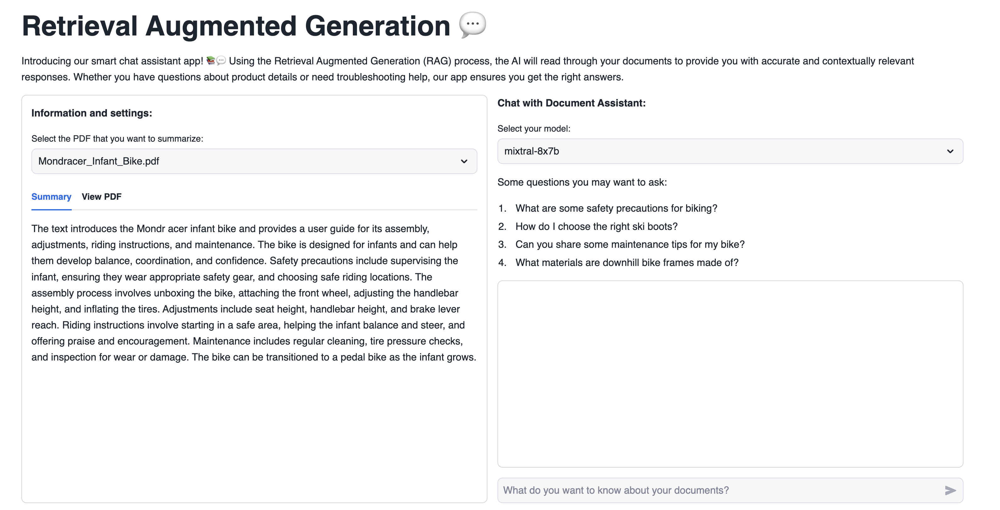

# Retrieval Augmented Generation with Snowflake Cortex

**What is Retrieval Augmented Generation (RAG)?** \
Retrieval-Augmented Generation (RAG) is a two-phase process involving document retrieval and answer formulation by a Large Language Model (LLM). It is a hybrid approach in natural language processing (NLP) that combines the strengths of information retrieval and generative models to produce more accurate and contextually relevant responses.

In this demo, we will show you how easy it is to implement RAG with a chat assistant that is knowledgeable on a specific topic.\
To make the assistant knowledgeable, we will give it access to a few user manuals.\
This app can easily be adapted to other documents that interest you, whether they are financial reports, research papers, or anything else!

**A smart chat assistant app!** 📚💬\
Using the Retrieval Augmented Generation (RAG) process, the AI will read through documents to provide accurate and contextually relevant responses to questions.

## App data
1. Open a new SQL Worksheet.

2. Copy the contents of the file `data/creation_script.sql` into the Worksheet. Execute the `CREATE` statements of the script, which creates a database, schema, stage, function and the appropriate table for the app.

3. In the newly created `RAG_DEMO` stage, upload the `.pdf` files from the `docs` folder. You can use Snowsight to upload this file into the database and schema created earlier. Refer to the [Snowflake](https://docs.snowflake.com/en/user-guide/data-load-web-ui) documentation for detailed instructions.

4. Within `creation_script.sql`, there is a `INSERT` statement to load data from the `.pdf` file into the newly created table. Run this statement in the SQL Worksheet.

5. When you create a new Streamlit App, Snowflake automatically generates a new stage for this app. Access this stage in the Data section on the left side of the screen. Navigate to Databases, find the database associated with your Streamlit App (e.g., `SampleDatabase.RAG_DEMO`).

6. Select the database, then choose the schema where you created the Streamlit App (e.g., public).

.

7. Navigate to Stages to view the available stages. Snowflake has automatically created a Stage with an autogenerated name.

.

8. Click on the stage name. The first time, it will prompt you to “Enable Directory Listing”. Click on that button.

.

9. Choose a warehouse.

.

10. Click on “+ Files” in the upper right corner to open a popup where you can add the required files.

11. Upload the files by clicking on the "Upload" button in the lower right corner. Note that if a file has the same name as an existing file in the stage, the new file will overwrite the previous one.

.

12. With these steps, you have successfully uploaded files into your Streamlit App.