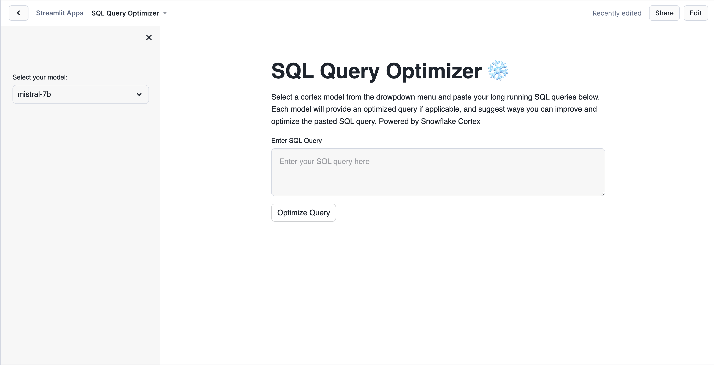

# SQL Query Optimizer using Snowflake Cortex

Dealing with slow-running SQL queries can be frustrating and costly. Inefficient queries can sap both compute credits and productivity. Here's a Streamlit application that leverages [Snowflake Cortex](https://docs.snowflake.com/en/user-guide/snowflake-cortex/overview) to streamline this process. Here are three key benefits you can expect:

1. Save on Compute Credits: Efficiently optimized queries mean less compute time and lower costs.

2. Boost Performance: Faster query execution times will enhance your overall data processing and analysis speed.

3. Simplify Optimization: Let Snowflake Cortex handle the heavy lifting of query optimization, so you can focus on what matters most. Simply copy, paste, and run.

## App visuals

