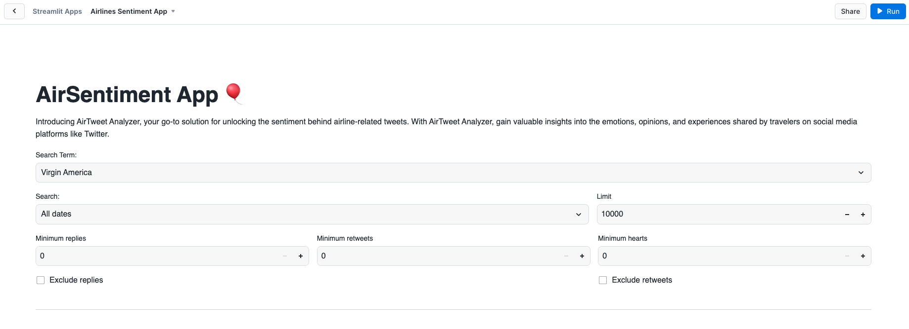
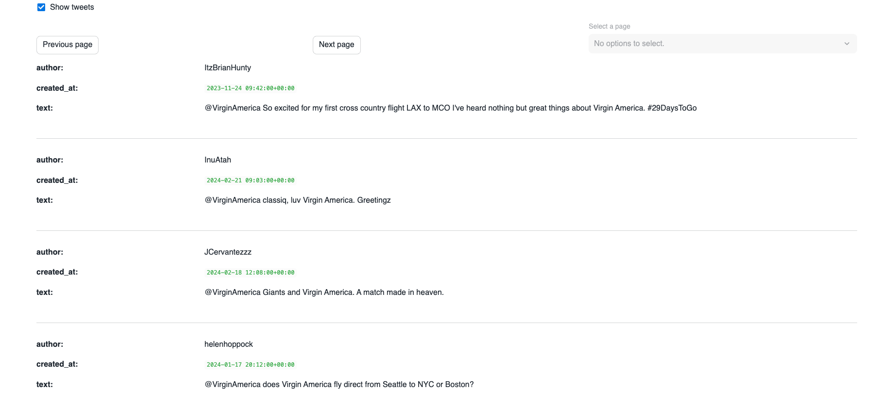

## Sentiment Analysis using NLTK

Introducing AirTweet Analyzer, your go-to solution for unlocking the sentiment behind airline-related tweets. With AirTweet Analyzer, gain valuable insights into the emotions, opinions, and experiences shared by travelers on social media platforms like Twitter.

## App layout

Below we can see the main layout where you can play around with the provided filters.


Here we can see the analysis results for the sentiment:


Here we can see the term count:


Here we can see the word counts:


Bigrams are pairs of consecutive words that capture nuanced meanings and context, enhancing the accuracy of sentiment classification by considering phrase-level sentiment implications. Here we can see the bigram count:


Trigrams are sequences of three consecutive words that capture nuanced meanings and context, further refining sentiment classification accuracy by considering longer, phrase-level sentiment implications. Here we can see the trigram count:


Noun-phrases are sequences of words that include a noun and its modifiers, capturing specific aspects of context and sentiment to enhance classification accuracy. Here we can see the noun-phrase count:


Here we can visualize the paginated tweets:


Here we can visualize a raw tweet.


## Dataset

This dataset is publicly available on [Kaggle](https://www.kaggle.com/datasets/crowdflower/twitter-airline-sentiment) and available under a [CC BY-NC-SA 4.0](https://creativecommons.org/licenses/by-nc-sa/4.0/) license.


This data originally came from [Crowdflower's Data for Everyone library](http://www.crowdflower.com/data-for-everyone).

As the original source says,

> A sentiment analysis job about the problems of each major U.S. airline. Twitter data was scraped from February of 2015 and contributors were asked to first classify positive, negative, and neutral tweets, followed by categorizing negative reasons (such as "late flight" or "rude service").

For convenience, the csv dataset is also provided in the `assets` folder. 

## App data set up

To run this app the following objects need to be created in the Snowflake account:

```sql
USE ROLE SYSADMIN;

CREATE OR REPLACE DATABASE airlines_sentiment_db;
CREATE OR REPLACE SCHEMA airlines_sentiment_s;

CREATE OR REPLACE NETWORK RULE airlines_sentiment_db.airlines_sentiment_s.NLTK
  MODE = EGRESS
  TYPE = HOST_PORT
  VALUE_LIST = ('nltk.org');

CREATE OR REPLACE NETWORK RULE airlines_sentiment_db.airlines_sentiment_s.GITHUB_USER_CONTENT
  MODE = EGRESS
  TYPE = HOST_PORT
  VALUE_LIST = ('raw.githubusercontent.com');

CREATE OR REPLACE EXTERNAL ACCESS INTEGRATION airlines_sentiment_a_i
  ALLOWED_NETWORK_RULES = ( airlines_sentiment_db.airlines_sentiment_s.NLTK,airlines_sentiment_db.airlines_sentiment_s.GITHUB_USER_CONTENT )
  ENABLED = TRUE;

CREATE OR REPLACE TABLE airlines_sentiment_db.airlines_sentiment_s.airline_sentiment_table (
	TEXT VARCHAR(16777216),
	TWEET_CREATED TIMESTAMP_LTZ(9),
	NAME VARCHAR(16777216),
	_UNIT_ID VARCHAR(16777216),
	RETWEET_COUNT VARCHAR(16777216),
	IS_REPLY BOOLEAN,
	IS_RETWEET BOOLEAN,
	FAVES NUMBER(3,0),
	REPLIES NUMBER(3,0)
);
```

You can populate the "airline_sentiment_table" table by uploading the csv after downloading it from Kaggle.


