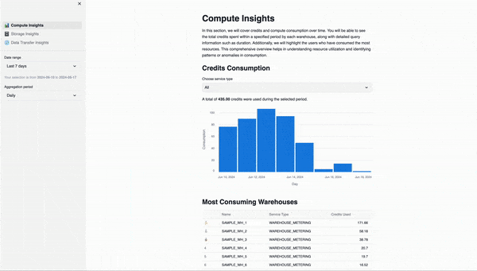
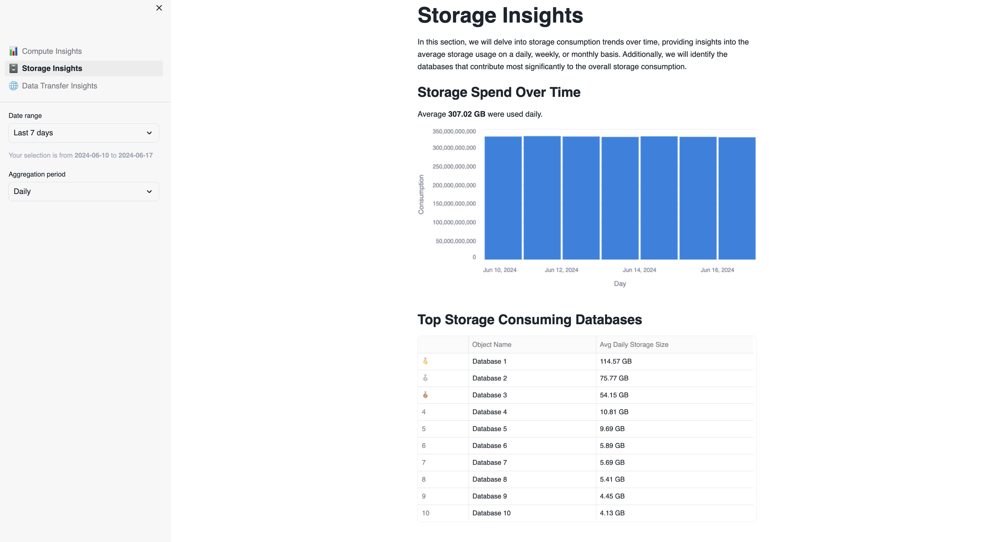
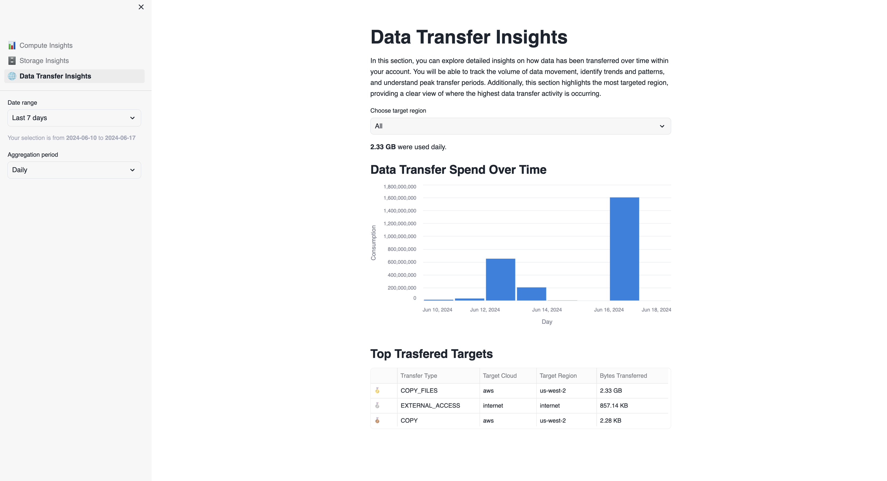

# Snowflake Account Usage

Welcome to the Snowflake Account Usage! This application is designed to provide you with detailed insights into various aspects of your Snowflake account usage. The app is divided into three main sections to help you monitor and analyze your account's usage.

**1. Compute Consumption** 📊\
In this section, you will find charts and tables that provide insights into credit consumption. You can identify which warehouses have consumed the most credits, analyze query performance, and see which users are using the most resources. This section is crucial for understanding how your compute resources are being utilized.

**2. Storage Consumption** 🗄️\
This section focuses on storage usage across your databases. You can view which databases are consuming the most storage and track storage trends over time. This information is vital for managing storage costs and optimizing database performance.

**3. Data Transfer Analytics** 🌐\
Here, you can analyze data transfer activities over time. The charts and tables in this section will show you how much data has been transferred and help you identify patterns in data movement. This is important for optimizing data transfer processes and managing associated costs.

### Usage Notes:

For each section, there is a sidebar available on the left side of the app. This sidebar allows you to:

**Define the Timeframe:** Select the timeframe for which you want to view the data. This feature enables you to limit the charts and tables to a specific period, providing a more focused analysis.

**Aggregation Options:** Use the aggregation combobox to choose how you want to aggregate the data. You can select daily, weekly, or monthly aggregation to better understand usage patterns over different periods.

With these tools, the Snowflake Account Usage app provides a comprehensive overview of your account's compute, storage, and data transfer activities, helping you make informed decisions and optimize your Snowflake resources.

## Requirement
Data used by this application is retrieved from the following views:
    - `SNOWFLAKE.ACCOUNT_USAGE.QUERY_HISTORY`.
    - `SNOWFLAKE.ACCOUNT_USAGE.METERING_HISTORY`.
    - `SNOWFLAKE.ACCOUNT_USAGE.DATABASE_STORAGE_USAGE_HISTORY`.
    - `SNOWFLAKE.ACCOUNT_USAGE.STAGE_STORAGE_USAGE_HISTORY`.
    - `SNOWFLAKE.ACCOUNT_USAGE.DATA_TRANSFER_HISTORY`.

By default, those views are only available to the `ACCOUNTADMIN` role.
Please keep in mind this important requirement.

To learn more about the `ACCOUNT_USAGE` view check out the Snowflake [documentation](https://docs.snowflake.com/en/sql-reference/account-usage)

## Installation
1. Open a new SQL Worksheet.

2. Copy the contents of the file `data/creation_script.sql` into the Worksheet. Execute the `CREATE` statements of the script, which creates a database and schema.

3. When you create a new Streamlit App, Snowflake automatically generates a new stage for this app. Access this stage in the Data section on the left side of the screen. Navigate to Databases, find the database associated with your Streamlit App (e.g., `SAMPLEDATABASE.ACCOUNT_USAGE`).

4. Select the database, then choose the schema where you created the Streamlit App (e.g., public).

.

5. Navigate to Stages to view the available stages. Snowflake has automatically created a Stage with an autogenerated name.

.

6. Click on the stage name. The first time, it will prompt you to “Enable Directory Listing”. Click on that button.

.

7. Choose a warehouse.

.

8. Click on “+ Files” in the upper right corner to open a popup where you can add the required files.

9. Upload the files by clicking on the "Upload" button in the lower right corner. Note that if a file has the same name as an existing file in the stage, the new file will overwrite the previous one (Select all the files in the root of the folder).

.

10. With these steps, you have successfully uploaded files into your Streamlit App.