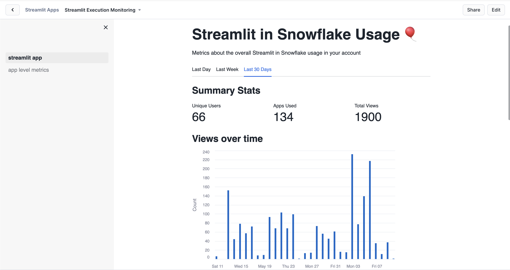
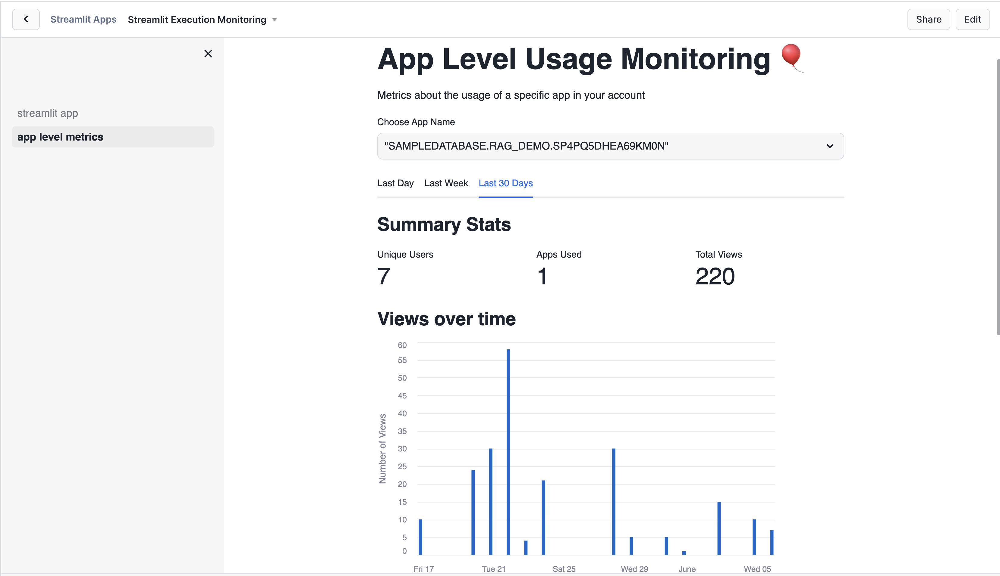

# Streamlit in Snowflake Usage Monitoring

This app helps Accountadmins monitor the usage of Streamlit in Snowflake apps. It uses the [Account Usage](https://docs.snowflake.com/en/sql-reference/account-usage) schema to query historical usage data for your account. 
 

## Prerequisites

The App Owner Role must have SELECT privileges on the [Query History view](https://docs.snowflake.com/en/sql-reference/account-usage/query_history). 


## App Layout

This app contains 2 tabs:

1. Account Level App Usage
2. App Level Usage


### Account Level Usage



### App Level Usage



### Raw Data

The app also shows the Raw data powering the graphs above. 


## Streamlit Execution Metadata

All Streamlit in Snowflake apps executions are recorded in the [Query History view](https://docs.snowflake.com/en/sql-reference/account-usage/query_history). This can be visualized by going to `Monitoring` -> `Query History` in Snowsight. For example, all Streamlit app executions show up as 

```sql
execute streamlit "ST_TEST_DB"."DEV"."KP1V05SACRMOJ9PX"()
```

You can also run a SQL query in a Worksheet to obtain the same information. 

```sql
select 
    user_name as User,
    total_elapsed_time/60000 as Minutes_Used, 
    date(start_time) as Date,
    try_parse_json(query_tag):StreamlitName as AppName,
    query_text
from snowflake.monitoring.query_history
where 
    -- Enter a date in the line below
    start_time >= '{start_date}'
    and try_parse_json(query_tag):StreamlitEngine = 'ExecuteStreamlit'
    and try_parse_json(query_tag):ChildQuery IS NULL
    and contains(query_text, 'execute streamlit') 
    order by Date desc;
```

All Streamlit in Snowflake app executions contain a `QUERY_TAG`, for e.g. 

```json
{
    "StreamlitEngine":"ExecuteStreamlit",
    "StreamlitName":"ST_TEST_DB.DEV.KP1V05SACRMOJ9PX"
}
```

Any child queries executed by the app also contain an additional field in the `QUERY_TAG` indicating that it is a child query

```json
{
    "StreamlitEngine":"ExecuteStreamlit",
    "StreamlitName":"ST_TEST_DB.DEV.KP1V05SACRMOJ9PX",
    "ChildQuery":true
}
```

