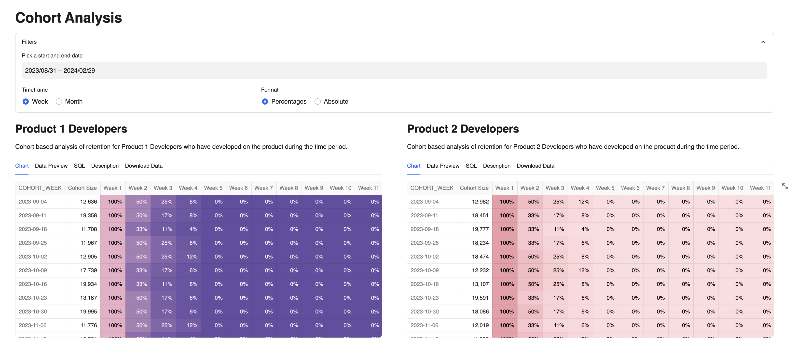
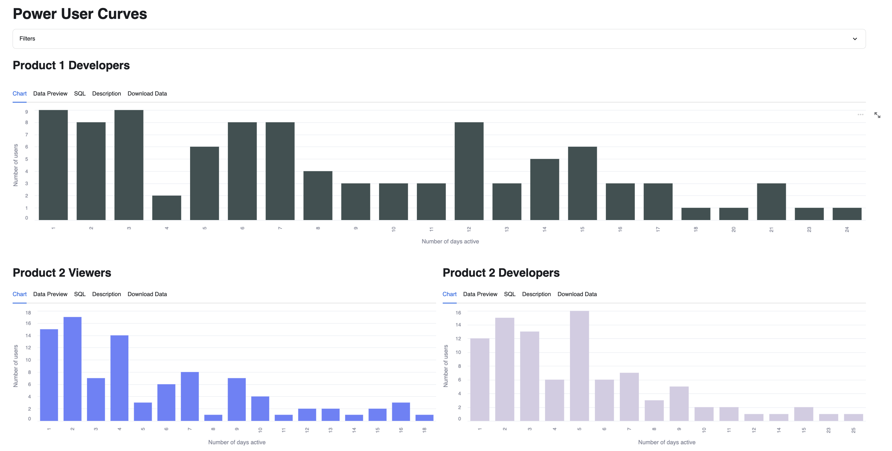
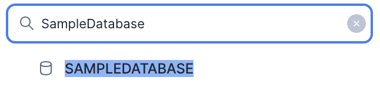

## User Retention Chart App
This application comprises two distinct analyses. The first is a cohort analysis, the kind of analysis can ilustrate how many customers have come back to the product in weeks or months after they first start using the product.

The second component is the Power User Curve charts. These graphs illustrate the distribution of user engagement with a product over time. Power users, being the most active and loyal customers, are featured in these charts, showcasing their level of engagement with the product.

## App layout
The following image is the upper section of the app, that shows the Cohort Analysis, it have some filters, the main one being the start and end date, it narrows the time scope of the query, it also aggregates by week or month, at last the number of users can be visualized in percentages or absolute values.

In the the lower section of the app, there are some power user curves charts that shows how the users have been behaving in a given time range.

## App data
### Prerequisites:
- Have a Snowflake account.
- The Snowflake account should at least have the permissions to create new databases and tables.
- Here is the official [Streamlit documentation](https://docs.snowflake.com/en/developer-guide/streamlit/about-streamlit).
### Installation:
1. Create a new SQL Worksheet.
2. Copy the contents in the file `data/creation_script.sql` into your Worksheet, execute the `CREATE` statements of the script, which creates a database, schema, stage and the appropriate tables for the app.
3. On the rencently created `UserRetentionStage` you have to upload the `.csv` files located on the `data` folder (Each file have the same name as the respective table). You can use Snowsight to upload this files, under the database and schema created in the first step. Here is the [Snowflake](https://docs.snowflake.com/en/user-guide/data-load-web-ui) documentaion on how to this process.
4. Inside of the `creation_script.sql`, there are some `COPY INTO` statements, so you can dump the data coming from the `.csv` into the recently created tables, this statement can be run on the Worksheet, created in the first step.
5. When you create a new Streamlit App, as the example. Snowflake automatically creates a new stage for this app.
This stage can be accessed on in the Data section, in the left part of the screen. Then click on Databases, here a list of all the available databases will appear, look for the database where you created your Streamlit App (On this case SampleDatabase).

6. Click on the database, it will show all the available schemas, click on the schema where you created the Streamlit App (On this case public).
.

7. Click on stages, it will show all the available stages available, as mentioned earlier, Snowflake automatically generated a Stage, that have a autogenerated name. 
.

8. Click on that name, the first time it will ask you to “Enable Directory Table”, click on that button.
.

9. Select a warehouse.
.

10. Click on “+ Files”, on the upper right corner, it will open a new popup where you can add the required files.

11. Click on Upload, on the lower right corner to upload the files. (Note: If a file have the same name as one already in the stage, the new file will overwrite the previous one)
.

12. And with that, you successfully upload files into your Streamlit App.

### Sample Data:
The tables `PRODUCT_1_RETENTION_BY_MONTH`, `PRODUCT_2_RETENTION_BY_MONTH`, `PRODUCT_1_RETENTION_BY_WEEK` and `PRODUCT_2_RETENTION_BY_WEEK` are required for the cohort analysis, either by week or month.

For the power curves, the required tables are the following `PRODUCT_1_ACTIVITY_BY_DAY`, `PRODUCT_2_ACTIVITY_BY_DAY` and `PRODUCT_2_VIEWS_ACTIVITY_BY_DAY`

On the following tables:
- Table: `PRODUCT_1_RETENTION_BY_MONTH`
- Table: `PRODUCT_2_RETENTION_BY_MONTH`

The data should look like this:

|COHORT_MONTH|ACTION_MONTH|NUM_USERS|
|------------|:----------:|:----:|
| 2022-01-01 | 2023-03-01 | 75132 |
| 2022-01-01 | 2022-04-01 | 96230 |
| 2022-01-01 | 2023-02-01 | 10496 |
| 2022-04-01 | 2022-04-01 | 20324 |
| 2022-04-01 | 2022-12-01 | 98474 |
-----------------------------------

On the following tables:
- Table: `PRODUCT_1_RETENTION_BY_WEEK`
- Table: `PRODUCT_2_RETENTION_BY_WEEK`

The data should look like this:

|COHORT_WEEK|ACTION_WEEK|NUM_USERS|
|------------|:----------:|:----:|
| 2022-01-03 | 2022-02-14 | 1126 |
| 2022-01-10 | 2022-01-24 | 3528 |
| 2022-01-17 | 2022-01-31 | 1314 |
| 2022-01-24 | 2022-02-14 | 2503 |
| 2022-01-31 | 2022-03-07 | 2692 |
----------------------------------

On the following tables:

- Table: `PRODUCT_1_ACTIVITY_BY_DAY`
- Table: `PRODUCT_2_ACTIVITY_BY_DAY`
- Table: `PRODUCT_2_VIEWS_ACTIVITY_BY_DAY`

The data should look like this:

| USERNAME   | DAY_OF_USE | 
|------------|:----------:|
| user_001   | 2023-10-29
| user_001   | 2023-10-14
| user_002   | 2023-11-16
| user_002   | 2024-08-24

